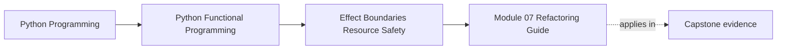

# Module 07 Refactoring Guide

<!-- page-maps:start -->
## Page Maps

<!-- page-maps:end -->

Read the first diagram as a placement map: this page is one concept inside its parent module, not a detached essay, and the capstone is the pressure test for whether the idea holds. Read the second diagram as the working rhythm for the page: name the problem, study the example, identify the boundary, then carry one review question forward.

This guide closes Module 07. The standard is not wishful purity. The standard is a core
that can name its capabilities and a boundary layer that can be reviewed under change.

## Stable comparison route

1. run `make PROGRAM=python-programming/python-functional-programming history-refresh`
2. open `capstone/_history/worktrees/module-07/src/funcpipe_rag/`
3. compare `domain/`, `boundaries/`, and `infra/`
4. read the adapter and domain tests under `capstone/_history/worktrees/module-07/tests/`

## What to refactor toward

- capabilities named as protocols or interfaces instead of ambient assumptions
- adapters that translate infrastructure details without bleeding them into the core
- resource, retry, and transaction rules that are explicit and testable
- migration steps that improve boundaries without pretending the system was rebuilt from scratch

## Exit standard

Before Module 08, you should be able to point to the exact seam where an effect enters
and explain why the core can still be reviewed independently.
