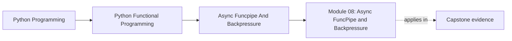
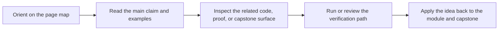

# Module 08: Async FuncPipe and Backpressure

<!-- page-maps:start -->
## Page Maps

<!-- page-maps:end -->

This module treats async code as a coordination problem, not a style choice. The learner
moves from effect boundaries to bounded concurrency, fairness, and testable async plans
that do not smear runtime behavior across the whole codebase.

## What this module teaches

- how async steps stay explicit instead of magical
- how backpressure and timeouts protect pipelines under load
- how adapters for external services fit around a pure core
- how to test async flows deterministically rather than by hope

## Lesson map

- [async/await as Descriptions](async-await-as-descriptions.md)
- [Async Generators](async-generators.md)
- [Backpressure](backpressure.md)
- [Retry and Timeout Policies](retry-and-timeout-policies.md)
- [Deterministic Async Testing](deterministic-async-testing.md)
- [Rate Limiting and Fairness](rate-limiting-and-fairness.md)
- [Async Adapters](async-adapters.md)
- [Async Service Integrations](async-service-integrations.md)
- [Async Chunking](async-chunking.md)
- [Async Pipeline Laws](async-pipeline-laws.md)
- [Refactoring Guide](refactoring-guide.md)

## Capstone checkpoints

- Inspect where async work is described and where it is actually driven.
- Review how bounded queues and fairness policies shape throughput.
- Compare test helpers with the runtime surfaces they are protecting.

## Before moving on

You should be able to explain how async coordination stays reviewable, what protects the
system from runaway work, and how to tell whether an async abstraction clarifies or hides
control flow. Use [Refactoring Guide](refactoring-guide.md) and compare against
`capstone/_history/worktrees/module-08` before moving forward.
