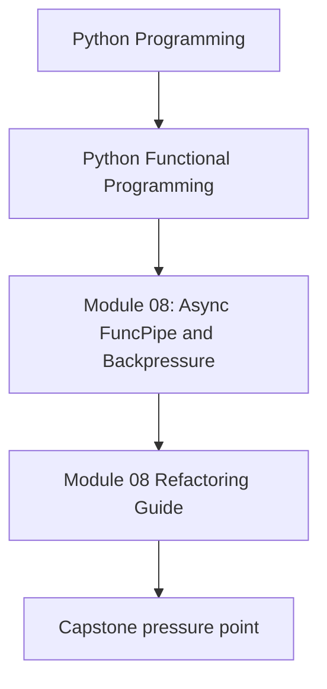
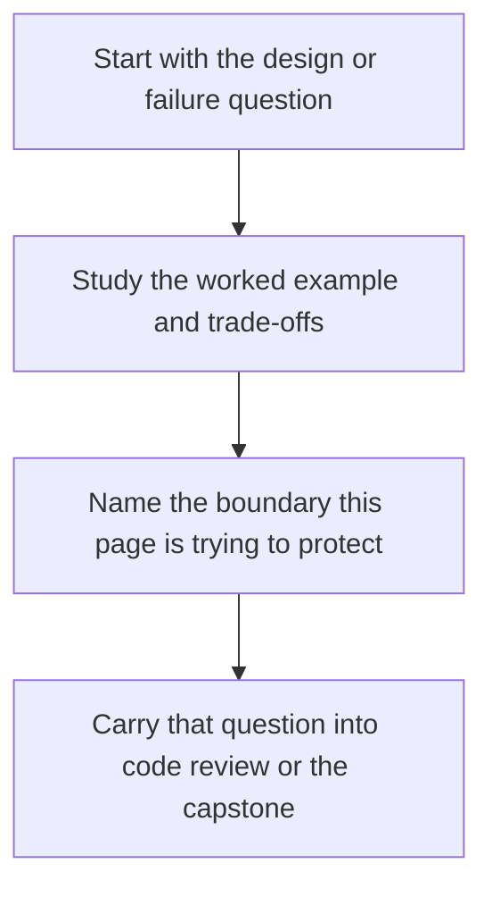

# Module 08 Refactoring Guide

<!-- page-maps:start -->
## Concept Position

<!-- page-maps:end -->

Read the first diagram as a placement map: this page is one concept inside its parent module, not a detached essay, and the capstone is the pressure test for whether the idea holds. Read the second diagram as the working rhythm for the page: name the problem, study the example, identify the boundary, then carry one review question forward.

This guide closes Module 08. Async code should still be a coordination plan that a human
can review. If the flow disappears behind runtime tricks, the module has not been learned
honestly.

## Stable comparison route

1. run `make PROGRAM=python-programming/python-functional-programming history-refresh`
2. open `capstone/_history/worktrees/module-08/src/funcpipe_rag/domain/effects/async_/`
3. compare the async coordination code with the queueing and adapter surfaces around it
4. read the async tests in `capstone/_history/worktrees/module-08/tests/`

## What to refactor toward

- async steps described explicitly instead of scattered across implicit callbacks
- bounded queues and fairness policies that protect the system under load
- retry and timeout behavior expressed as policy rather than duplicated control flow
- deterministic tests that show what the runtime is allowed to do

## Exit standard

Before Module 09, you should be able to explain how the runtime is driven, what limits
throughput, and which tests prove the async plan remains reviewable.
