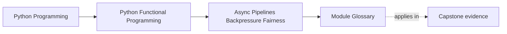
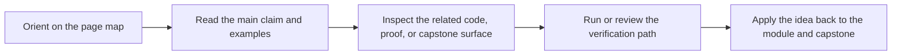

# Module Glossary

<!-- page-maps:start -->
## Page Maps

<!-- page-maps:end -->

This glossary belongs to **Module 08: Async Pipelines, Backpressure, and Fairness** in **Python Functional Programming**. It keeps the language of this directory stable so the same ideas keep the same names across reading, practice, review, and capstone proof.

## How to use this glossary

Read the directory index first, then return here whenever a page, command, or review discussion starts to feel more vague than the course intends. The goal is stable language, not extra theory.

## Terms in this directory

| Term | Meaning in this directory |
| --- | --- |
| Async Adapters | the module's treatment of async adapters, used to make the module's main design claim concrete in design work, refactoring, and capstone evidence. |
| Async Chunking | the module's treatment of async chunking, used to make the module's main design claim concrete in design work, refactoring, and capstone evidence. |
| Async Generators | the module's treatment of async generators, used to make the module's main design claim concrete in design work, refactoring, and capstone evidence. |
| Async Pipeline Laws | the module's treatment of async pipeline laws, used to make the module's main design claim concrete in design work, refactoring, and capstone evidence. |
| Async Service Integrations | the module's treatment of async service integrations, used to make the module's main design claim concrete in design work, refactoring, and capstone evidence. |
| async/await as Descriptions | the module's treatment of async/await as descriptions, used to make the module's main design claim concrete in design work, refactoring, and capstone evidence. |
| Backpressure | the module's treatment of backpressure, used to make the module's main design claim concrete in design work, refactoring, and capstone evidence. |
| Deterministic Async Testing | the module's treatment of deterministic async testing, used to make the module's main design claim concrete in design work, refactoring, and capstone evidence. |
| Module 08 Refactoring Guide | the repair route for applying the module's main design claim to existing code without losing behavior, clarity, or proof. |
| Rate Limiting and Fairness | the module's treatment of rate limiting and fairness, used to make the module's main design claim concrete in design work, refactoring, and capstone evidence. |
| Retry and Timeout Policies | the module's treatment of retry and timeout policies, used to make the module's main design claim concrete in design work, refactoring, and capstone evidence. |
