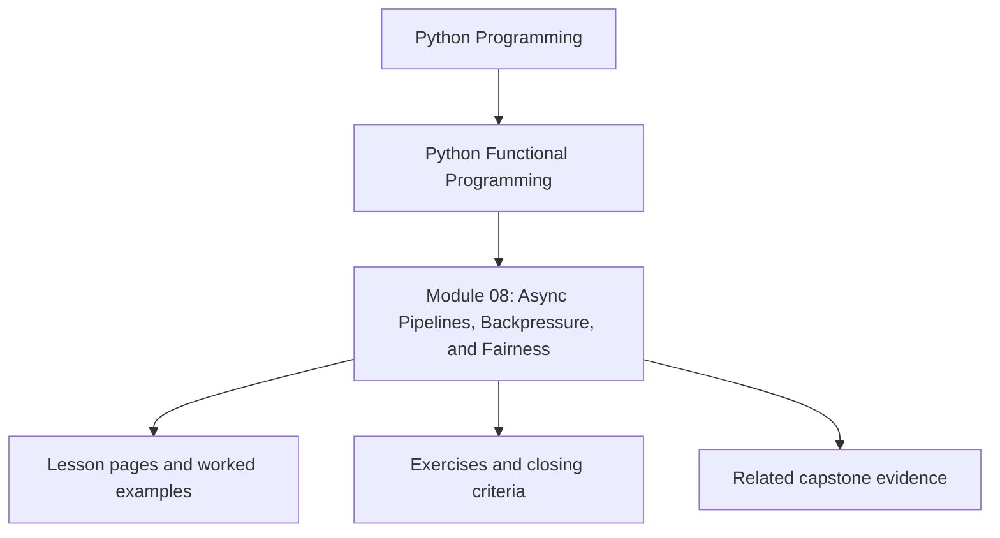
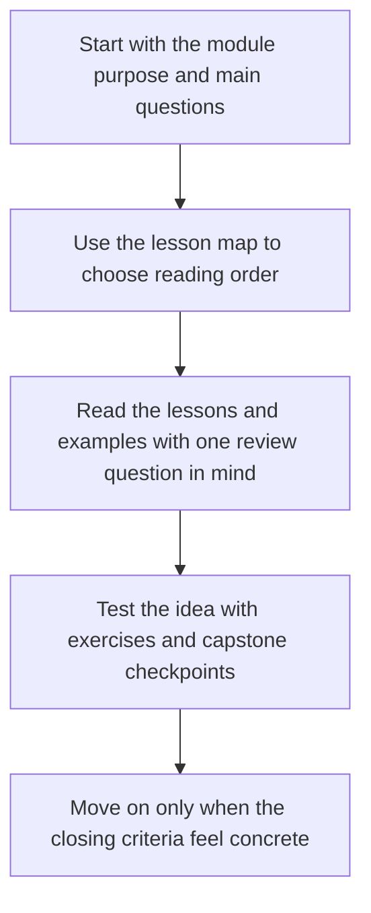

# Module 08: Async Pipelines, Backpressure, and Fairness

<!-- page-maps:start -->
## Module Position

<!-- page-maps:end -->

Read the first diagram as a placement map: this page sits between the course promise, the lesson pages listed below, and the capstone surfaces that pressure-test the module. Read the second diagram as the study route for this page, so the diagrams point you toward the `Lesson map`, `Exercises`, and `Closing criteria` instead of acting like decoration.

## Keep These Pages Open

Use these support surfaces while reading so async coordination stays reviewable and does
not quietly become magical concurrency vocabulary:

- [Mid-Course Map](../module-00-orientation/mid-course-map.md) for the bridge into effect and async pressure
- [Review Checklist](../reference/review-checklist.md) for the engineering bar around fairness and observability
- [Boundary Review Prompts](../reference/boundary-review-prompts.md) for pressure on async abstractions
- [Capstone Map](../capstone/capstone-map.md) for the async effect and runtime adapter surfaces in FuncPipe

Carry this question into the module:

> Which async behavior is being coordinated explicitly, and where would hidden scheduling or buffering make the system harder to reason about?

This module treats async code as a coordination problem, not a style choice. The learner
moves from effect boundaries to bounded concurrency, fairness, and testable async plans
that do not smear runtime behavior across the whole codebase.

## Learning outcomes

- how async steps stay explicit instead of magical
- how backpressure and timeouts protect pipelines under load
- how adapters for external services fit around a pure core
- how to test async flows deterministically rather than by hope

## Lesson map

- [async/await as Descriptions](async-await-as-descriptions.md)
- [Async Generators](async-generators.md)
- [Backpressure](backpressure.md)
- [Retry and Timeout Policies](retry-and-timeout-policies.md)
- [Deterministic Async Testing](deterministic-async-testing.md)
- [Rate Limiting and Fairness](rate-limiting-and-fairness.md)
- [Async Adapters](async-adapters.md)
- [Async Service Integrations](async-service-integrations.md)
- [Async Chunking](async-chunking.md)
- [Async Pipeline Laws](async-pipeline-laws.md)
- [Refactoring Guide](refactoring-guide.md)

## Exercises

- Identify one async boundary and explain where scheduling belongs and where pure transformation still belongs.
- Review one queue, timeout, or retry policy and state what pressure scenario it is meant to absorb.
- Compare one async test helper with the runtime path it protects and explain why the test remains deterministic.

## Capstone checkpoints

- Inspect where async work is described and where it is actually driven.
- Review how bounded queues and fairness policies shape throughput.
- Compare test helpers with the runtime surfaces they are protecting.

## Before moving on

You should be able to explain how async coordination stays reviewable, what protects the
system from runaway work, and how to tell whether an async abstraction clarifies or hides
control flow. Use [Refactoring Guide](refactoring-guide.md) and compare against
`capstone/_history/worktrees/module-08` before moving forward.

## Closing criteria

- You can explain how concurrency stays bounded instead of accidental.
- You can identify which async abstractions describe work and which ones actually drive execution.
- You can defend an async design in terms of fairness, backpressure, and testability.
