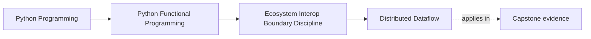
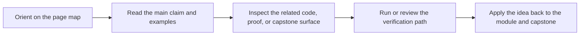

# Distributed Dataflow

<!-- page-maps:start -->
## Page Maps




<!-- page-maps:end -->

Read the first diagram as a placement map: this page is one concept inside its parent module, not a detached essay, and the capstone is the pressure test for whether the idea holds. Read the second diagram as the working rhythm for the page: name the problem, study the example, identify the boundary, then carry one review question forward.

**Module 09**
> **Core question:**
> How do you reason about distributed execution seams without pretending the default FuncPipe capstone already ships a distributed backend, while still preserving the same functional contracts you would need if one were added later?

In this core, the most important honesty rule comes first: the shipped repository does not include a working Dask or Beam backend. What it does include is the architectural seam where one could be added without rewriting the course's pure helpers, pipeline assembly, or review story. That means the default route here is about design discipline before implementation breadth: what contracts a distributed boundary would need, what kinds of operators remain lawful under partitioning and retries, and how to keep optional backends from polluting the default proof surface.

To align these systems with FP, we model pipelines as lazy graphs of operators, where each operator has an explicit algebraic contract that guarantees correct behavior under distribution (e.g., associativity for reductions to allow parallel aggregation without order-dependence). We focus on pure transforms (stateless functions operating on individual elements or partitions without side effects), explicit sinks (final steps confined to I/O, such as writing results to files or databases, with idempotence guarantees), and simple stateful operators (like combines with monoids for aggregations). Pipelines are configured via data structures (e.g., YAML specifying operator sequence, contracts like monoids, runner/backend settings, resources, serialization rules, and materialization points), seamlessly integrating with FuncPipe's ADTs (e.g., mapping FPResult over partitions to handle per-element failures). We refactor the RAG ingestion process (e.g., processing massive document sets into embeddings) into these distributed FP pipelines, verifying equivalence to local versions and laws like purity (fixed inputs yield identical outputs under a fixed scheduler) and associativity for reducers.

If you later build this seam out locally, Dask is usually the closer Python-native fit and Beam is the broader portability fit. But those are extension decisions, not current obligations in this repo.

**Motivation Bug:** Imperative distributed code often embeds effects (e.g., I/O or state mutation) directly in computation steps, leading to non-reproducible runs, hard-to-test graphs, and failures under retries or shuffles. FP style enforces a clear boundary: pure, composable transforms build the graph lazily, while effects are confined to idempotent sinks, enabling reliable scaling without sacrificing testability or debuggability.

**Delta from Core 6 (Module 09):** The CLI provides user-facing entry points for running pipelines; this core extends FuncPipe to distributed execution, where graphs are built as composable operators with algebraic guarantees, allowing seamless local-to-cluster transitions.

**Distributed Protocol (Contract, Entry/Exit Criteria):**
- **Purity:** Transforms must be referentially transparent (outputs depend only on inputs, injected artifacts, and config); no mutable globals or network calls inside operators; idempotent under retries/duplication (e.g., no incrementing counters); worker-local caches are allowed if read-only and deterministic (e.g., model loading in setup).
- **Determinism:** Under fixed scheduler and no floating-point ops, fixed inputs yield fixed outputs; floating-point ops require tolerance in equivalence checks; nondeterminism from scheduling/reordering requires contracts (e.g., commutative monoids for reductions).
- **Composability:** Graphs are built as sequences of typed operators (e.g., Map, FlatMap, Combine); each operator declares its contract (e.g., monoid for reductions) to ensure associativity/commutativity under reordering.
- **Laziness:** Construct the graph without execution; trigger compute/submit only at the end (Dask.compute, Beam.run) or explicit materialization points.
- **Semantics:** Laws like purity (a transform on fixed inputs is deterministic under a fixed scheduler); equivalence (distributed graph == local execution up to partitioning, ordering, and batching, given operator contracts); idempotence for sinks (repeat writes produce the same result or are transactional); verified via property tests with local runners and keyed/tolerant comparisons.
- **Integration:** Keep distributed backends behind explicit compilers or adapters so the shipped local proof route stays unchanged.
- **Mypy Config:** --strict on the local seam; optional backend imports stay guarded.

Use this when you are scaling FP pipelines to distributed systems and need pure transforms in dataflows while handling state, shuffles, and failures gracefully.

**Outcome:**
1. Define the operator and sink contracts a distributed backend would have to preserve.
2. Identify where Dask or Beam could attach without changing the local proof route.
3. Judge whether a distributed backend belongs in the repository at all before implementing one.
---
## 1. Laws & Invariants
| Law | Description | Enforcement |
|----------------------|---------------------------------------------------------------------------------------------|----------------------|
| **Purity Law** | Transforms depend only on inputs; no globals or side effects. | Type checks/runtime validation in IR builder |
| **Equivalence Law** | Distributed result == local for same inputs (up to partitioning/ordering/batching). | Hypothesis with keyed multisets + tolerance |
| **Idempotence Inv** | Repeat runs same output if idempotent logic. | Property tests with retry simulation |
| **Partition Inv** | Elementwise transforms preserve element independence; stateful stages declare monoid/window. | IR build-time contract checks |

These laws ensure distributed layers don't break FP properties. Enforcement uses type-level contracts (e.g., requiring Monoid typeclass for Combine) and runtime assertions in the graph builder. Preconditions: For commutativity-dependent ops, monoid must be commutative (tested via properties).

---
## 2. Decision Table
| Scenario | Portability Needed | Data Type | Recommended |
|-----------------------|--------------------|-----------|-------------|
| Default route in this repo | N/A | Local review and proof | stay on the shipped local pipeline |
| Python-only scale | No | Arrays/DF | Dask DataFrame |
| Python-only scale | No | Unstructured | Dask Bag |
| Custom tasks | No | Any | Dask Delayed |
| Multi-lang/runners | Yes | General | Beam |
| Lazy graphs with explicit extension work | Any | Any | choose one backend and keep it behind the seam |

**Do not add a distributed backend just because the domain could justify one. Add it only when the existing local proof route is no longer enough.**
---
## 3. Public API (Graph Builders & Transforms)
Builders as funcs. Guard imports. We define an intermediate representation (IR) for operators with algebraic contracts to ensure composability and validation before backend mapping.

**Repo alignment note (end-of-Module-09):**
- Dask/Beam are optional and not part of this repo’s default dependency set.
- This repo includes an import-guarded extension seam stub for compilers at `capstone/src/funcpipe_rag/pipelines/distributed.py`.
- That file is intentionally a boundary marker: it documents where distributed backends would attach without claiming that Dask or Beam are part of the default proof route.

**Canonical default route:**
- Open `capstone/src/funcpipe_rag/pipelines/distributed.py` to see the seam.
- Keep reading the local pipeline and proof surfaces as the canonical implementation.
- Treat the code below as design scaffolding for an optional backend, not as a promise that this repo already ships one.

```python
from typing import Callable, TypeVar, Any, List, Dict, Optional, Literal, Union
from funcpipe_rag import FPResult, RawDoc, Chunk, CleanDoc, EmbeddedChunk, Ok, Err, is_ok, raise_on_err
from funcpipe_rag import Monoid  # Reuse canonical Monoid from Module 05
from dataclasses import dataclass
import yaml
from pydantic import BaseModel, Field, validator
from typing_extensions import TypedDict

DASK_AVAILABLE = False
BEAM_AVAILABLE = False
try:
    import dask
    import dask.bag as db
    from dask.distributed import Client, LocalCluster

    DASK_AVAILABLE = True
except ImportError:
    DASK_AVAILABLE = False
try:
    import apache_beam as beam
    from apache_beam.transforms import PTransform
    from apache_beam.coders import Coder
    from apache_beam.transforms.combiners import CombineFn

    BEAM_AVAILABLE = True
except ImportError:
    BEAM_AVAILABLE = False

T = TypeVar('T')
U = TypeVar('U')


class TypeId(str):
    """String tag for type identity, e.g. 'FPResult[CleanDoc]'"""
    pass


# ErrorPolicy for FPResult handling
ErrorPolicy = Literal["drop", "collect", "fail_fast"]


# Monoid with optional commutative flag
@dataclass
class SumMonoid(Monoid[int]):
    commutative: bool = True

    def empty(self) -> int: return 0

    def combine(self, a: int, b: int) -> int: return a + b


# Func registry to avoid globals
class FuncRegistry(TypedDict):
    funcs: Dict[str, Callable]
    lifts: Dict[str, Callable[[T], FPResult[U]]]
    monoids: Dict[str, Monoid]


DEFAULT_REGISTRY: FuncRegistry = {
    'funcs': {
        'clean_doc': clean_doc,
        'chunk_doc': chunk_doc,
        'embed_batch': embed_batch,
    },
    'lifts': {
        'some_lift_func': some_lift_func,
    },
    'monoids': {
        'sum': SumMonoid(),
    }
}


@dataclass
class SinkContract:
    idempotent: bool


# Operator IR ADTs
@dataclass
class MapOp:
    name: str
    func: Callable[[T], FPResult[U]]
    in_type: TypeId
    out_type: TypeId
    error_policy: ErrorPolicy


@dataclass
class FlatMapOp:
    name: str
    func: Callable[[T], List[FPResult[U]]]
    in_type: TypeId
    out_type: TypeId
    error_policy: ErrorPolicy


@dataclass
class BatchMapOp:
    name: str
    func: Callable[[List[T]], List[FPResult[U]]]
    in_type: TypeId
    out_type: TypeId
    error_policy: ErrorPolicy
    max_batch_size: int = 128


@dataclass
class CombineOp:
    name: str
    lift: Callable[[T], FPResult[U]]
    monoid: Monoid[U]
    in_type: TypeId
    out_type: TypeId
    error_policy: ErrorPolicy


@dataclass
class SinkOp:
    name: str
    func: Callable[[U], None]
    in_type: TypeId
    contract: SinkContract


Operator = MapOp | FlatMapOp | BatchMapOp | CombineOp | SinkOp


# YAML Config Schema Example (first op consumes FPResult[RawDoc])
# operators:
#   - type: Map
#     name: clean
#     func: clean_doc
#     error_policy: drop
#     in_type: FPResult[RawDoc]
#     out_type: FPResult[CleanDoc]
#   - type: FlatMap
#     name: chunk
#     func: chunk_doc
#     error_policy: collect
#     in_type: FPResult[CleanDoc]
#     out_type: FPResult[Chunk]
#   - type: BatchMap
#     name: embed
#     func: embed_batch
#     max_batch_size: 128
#     error_policy: drop
#     in_type: FPResult[Chunk]
#     out_type: FPResult[EmbeddedChunk]
#   - type: Sink
#     name: write
#     func: write_chunk
#     contract: {idempotent: true}
#     in_type: FPResult[EmbeddedChunk]

class OpConfig(BaseModel):
    type: Literal["Map", "FlatMap", "BatchMap", "Combine", "Sink"]
    name: str
    func: str
    error_policy: ErrorPolicy = "collect"
    monoid: Optional[str] = None
    lift: Optional[str] = None
    max_batch_size: Optional[int] = None
    contract: Optional[Dict[str, Any]] = None
    in_type: str
    out_type: str


class PipelineConfig(BaseModel):
    operators: List[OpConfig]
    backend: Literal["dask", "beam"]
    resources: Dict[str, Any] = Field(default_factory=dict)
    materialization_points: List[str] = Field(default_factory=list)


def load_config(yaml_path: str) -> PipelineConfig:
    with open(yaml_path, 'r') as f:
        data = yaml.safe_load(f)
    return PipelineConfig.model_validate(data)


def build_ir_from_config(
        config: PipelineConfig,
        registry: FuncRegistry | None = None
) -> List[Operator]:
    reg = registry or DEFAULT_REGISTRY
    ir = []
    prev_out_type = TypeId(config.operators[0].in_type)
    if prev_out_type != TypeId("FPResult[RawDoc]"):
        raise ValueError("First operator must consume FPResult[RawDoc]")
    for op_cfg in config.operators:
        func = reg['funcs'].get(op_cfg.func)
        if func is None:
            raise ValueError(f"Func {op_cfg.func} not in registry")
        name = op_cfg.name
        error_policy = op_cfg.error_policy
        in_type = TypeId(op_cfg.in_type)
        out_type = TypeId(op_cfg.out_type)
        if in_type != prev_out_type:
            raise ValueError(f"Type mismatch at {name}")
        if op_cfg.type == 'Map':
            ir.append(MapOp(name, func, in_type, out_type, error_policy))
        elif op_cfg.type == 'FlatMap':
            ir.append(FlatMapOp(name, func, in_type, out_type, error_policy))
        elif op_cfg.type == 'BatchMap':
            ir.append(BatchMapOp(name, func, in_type, out_type, error_policy, op_cfg.max_batch_size or 128))
        elif op_cfg.type == 'Combine':
            if op_cfg.monoid is None:
                raise ValueError("Monoid required")
            monoid = reg['monoids'].get(op_cfg.monoid)
            if monoid is None:
                raise ValueError(f"Monoid {op_cfg.monoid} not in registry")
            lift = reg['lifts'].get(op_cfg.lift)
            if lift is None:
                raise ValueError(f"Lift {op_cfg.lift} not in registry")
            if not getattr(monoid, 'commutative', False):
                raise ValueError(f"CombineOp {name} requires commutative monoid")
            ir.append(CombineOp(name, lift, monoid, in_type, out_type, error_policy))
        elif op_cfg.type == 'Sink':
            if not op_cfg.contract or not op_cfg.contract.get('idempotent'):
                raise ValueError("Sink must be idempotent")
            ir.append(SinkOp(name, func, in_type, contract=SinkContract(idempotent=True)))
        prev_out_type = out_type
    if any(isinstance(op, SinkOp) for op in ir[:-1]):
        raise ValueError("Sinks must be terminal")
    if any(isinstance(op, CombineOp) and i != len(ir) - 1 for i, op in enumerate(ir)):
        raise ValueError("CombineOp must be terminal")
    return ir


# FPResult lifting helpers
def map_r(f: Callable[[T], FPResult[U]]) -> Callable[[FPResult[T]], FPResult[U]]:
    def g(r: FPResult[T]) -> FPResult[U]:
        if r.is_err: return r
        return f(r.value)

    return g


def flatmap_r(f: Callable[[T], List[FPResult[U]]]) -> Callable[[FPResult[T]], List[FPResult[U]]]:
    def g(r: FPResult[T]) -> List[FPResult[U]]:
        if r.is_err: return [r]
        return f(r.value)

    return g


def apply_policy_dask(bag, policy: ErrorPolicy):
    if policy == "drop":
        return bag.filter(is_ok)
    if policy == "fail_fast":
        return bag.map(raise_on_err)
    return bag  # collect: pass through


def apply_policy_beam(pcoll, policy: ErrorPolicy):
    if policy == "drop":
        return pcoll | beam.Filter(is_ok)
    if policy == "fail_fast":
        return pcoll | beam.Map(raise_on_err)
    return pcoll


# Backend compilers
def compile_to_dask(ir: List[Operator], data: List[RawDoc], config: PipelineConfig) -> Union[db.Bag, Delayed]:
    if not DASK_AVAILABLE:
        raise ImportError("Dask not available")
    bag = db.from_sequence(data, npartitions=config.resources.get('workers', 4)).map(Ok)  # Normalize source
    for op in ir:
        if isinstance(op, MapOp):
            bag = bag.map(map_r(op.func))
            bag = apply_policy_dask(bag, op.error_policy)
        elif isinstance(op, FlatMapOp):
            bag = bag.flatmap(flatmap_r(op.func))
            bag = apply_policy_dask(bag, op.error_policy)
        elif isinstance(op, BatchMapOp):
            def batch_part(part):
                buf = []
                for r in part:
                    if r.is_err:
                        yield r
                        continue
                    buf.append(r.value)
                    if len(buf) >= op.max_batch_size:
                        yield from op.func(buf)
                        buf = []
                if buf:
                    yield from op.func(buf)

            bag = bag.map_partitions(batch_part)
            bag = apply_policy_dask(bag, op.error_policy)
        elif isinstance(op, CombineOp):
            if op.error_policy == "collect":
                raise NotImplementedError("Collect policy in Combine")
            bag = bag.map(map_r(op.lift))
            bag = apply_policy_dask(bag, op.error_policy)
            bag = bag.filter(is_ok).map(lambda r: r.value)
            bag = bag.fold(op.monoid.combine, initial=op.monoid.empty(), combine=op.monoid.combine)
        if op.name in config.materialization_points:
            bag = bag.persist()
    return bag


def compile_to_beam(ir: List[Operator], data: List[RawDoc], config: PipelineConfig) -> PTransform:
    if not BEAM_AVAILABLE:
        raise ImportError("Beam not available")

    class CustomCoder(Coder):
        def encode(self, x): import pickle; return pickle.dumps(x)

        def decode(self, b): import pickle; return pickle.loads(b)

    beam.coders.registry.register_coder(FPResult, CustomCoder)

    def build_composite_transform() -> PTransform:
        class Composite(PTransform):
            def expand(self, pcoll):
                pcoll = pcoll | beam.Map(Ok)  # Normalize source
                for op in ir:
                    if isinstance(op, MapOp):
                        pcoll = pcoll | beam.Map(map_r(op.func))
                        pcoll = apply_policy_beam(pcoll, op.error_policy)
                    elif isinstance(op, FlatMapOp):
                        pcoll = pcoll | beam.FlatMap(flatmap_r(op.func))
                        pcoll = apply_policy_beam(pcoll, op.error_policy)
                    elif isinstance(op, BatchMapOp):
                        current_op = op

                        def batch_dofn():
                            class BatchDoFn(beam.DoFn):
                                def process(self, batch):
                                    buf = []
                                    for r in batch:
                                        if r.is_err:
                                            yield r
                                            continue
                                        buf.append(r.value)
                                        if len(buf) >= current_op.max_batch_size:
                                            for res in current_op.func(buf):
                                                yield res
                                            buf = []
                                    if buf:
                                        for res in current_op.func(buf):
                                            yield res

                            return BatchDoFn()

                        pcoll = pcoll | beam.BatchElements(max_batch_size=op.max_batch_size) | beam.ParDo(batch_dofn())
                        pcoll = apply_policy_beam(pcoll, op.error_policy)
                    elif isinstance(op, CombineOp):
                        if op.error_policy == "collect":
                            raise NotImplementedError("Collect policy in Combine")

                        def make_combine_fn(op: CombineOp):
                            class _Fn(CombineFn):
                                def create_accumulator(self):
                                    return op.monoid.empty()

                                def add_input(self, acc, input):
                                    r = map_r(op.lift)(input)
                                    if r.is_err:
                                        if op.error_policy == "drop":
                                            return acc
                                        if op.error_policy == "fail_fast":
                                            raise ValueError("Fail-fast")
                                    return op.monoid.combine(acc, r.value)

                                def merge_accumulators(self, accs):
                                    if not accs: return self.create_accumulator()
                                    acc = accs[0]
                                    for a in accs[1:]:
                                        acc = op.monoid.combine(acc, a)
                                    return acc

                            return _Fn()

                        pcoll = pcoll | beam.CombineGlobally(make_combine_fn(op))
                return pcoll

        return Composite()

    return build_composite_transform()
```
---
## What comes next

The main lesson should leave you able to see how a local functional pipeline maps to a
distributed backend without giving up the boundary rules. The next step is to review the
backend sketches, proofs, and failure modes before you move on.

Continue with [Distributed Dataflow Review](distributed-dataflow-review.md) before you
move into [Functional Facades](functional-facades.md).
