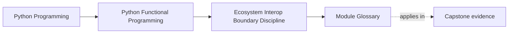
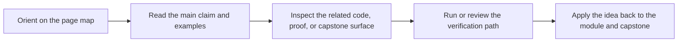

# Module Glossary

<!-- page-maps:start -->
## Page Maps

<!-- page-maps:end -->

This glossary belongs to **Module 09: Ecosystem Interop and Boundary Discipline** in **Python Functional Programming**. It keeps the language of this directory stable so the same ideas keep the same names across reading, practice, review, and capstone proof.

## How to use this glossary

Read the directory index first, then return here whenever a page, command, or review discussion starts to feel more vague than the course intends. The goal is stable language, not extra theory.

## Terms in this directory

| Term | Meaning in this directory |
| --- | --- |
| CLI and Config Pipelines | the module's treatment of cli and config pipelines, used to make the module's main design claim concrete in design work, refactoring, and capstone evidence. |
| Cross-Process Composition | the module's treatment of cross-process composition, used to make the module's main design claim concrete in design work, refactoring, and capstone evidence. |
| Data and ML Pipelines | the module's treatment of data and ml pipelines, used to make the module's main design claim concrete in design work, refactoring, and capstone evidence. |
| Data Processing | the module's treatment of data processing, used to make the module's main design claim concrete in design work, refactoring, and capstone evidence. |
| Distributed Dataflow | the module's treatment of distributed dataflow, used to make the module's main design claim concrete in design work, refactoring, and capstone evidence. |
| Distributed Dataflow Review | the review surface that pressure-tests the module after the first read so you can check judgment, not just recall. |
| Functional Facades | the module's treatment of functional facades, used to make the module's main design claim concrete in design work, refactoring, and capstone evidence. |
| Helper Libraries | the module's treatment of helper libraries, used to make the module's main design claim concrete in design work, refactoring, and capstone evidence. |
| Module 09 Refactoring Guide | the repair route for applying the module's main design claim to existing code without losing behavior, clarity, or proof. |
| Standard Library Functional Tools | the module's treatment of standard library functional tools, used to make the module's main design claim concrete in design work, refactoring, and capstone evidence. |
| Team Adoption | the module's treatment of team adoption, used to make the module's main design claim concrete in design work, refactoring, and capstone evidence. |
| Web and Services | the module's treatment of web and services, used to make the module's main design claim concrete in design work, refactoring, and capstone evidence. |
