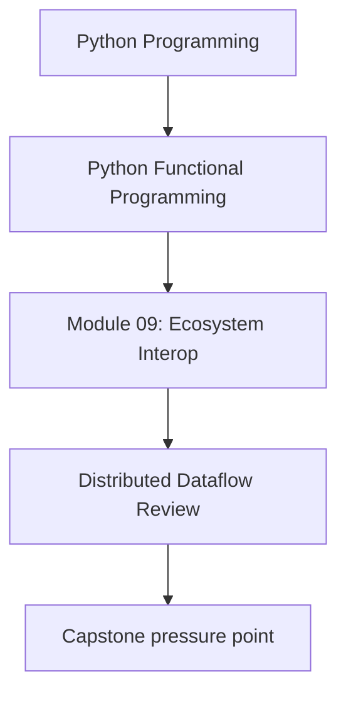
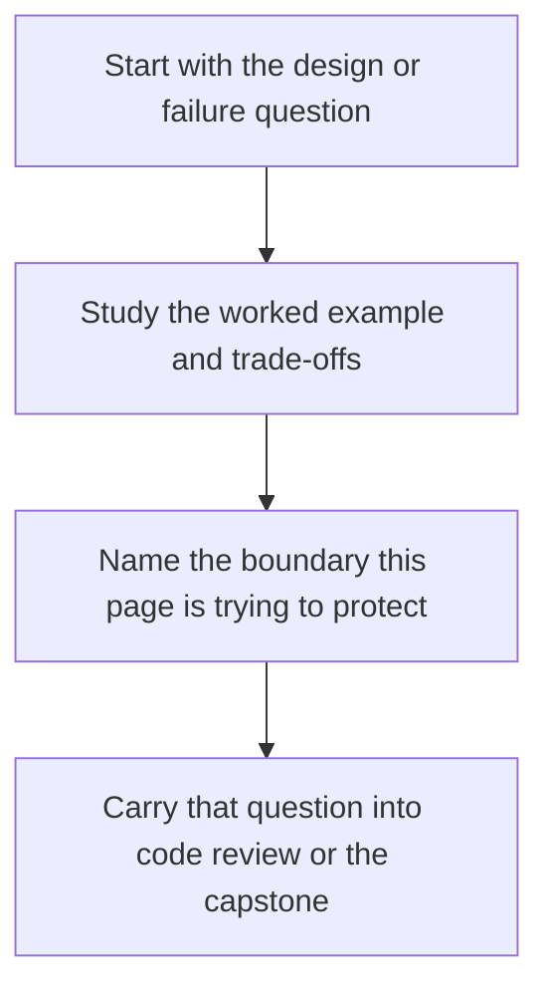

# Distributed Dataflow Review

<!-- page-maps:start -->
## Concept Position

<!-- page-maps:end -->

Read the first diagram as a placement map: this page is one concept inside its parent module, not a detached essay, and the capstone is the pressure test for whether the idea holds. Read the second diagram as the working rhythm for the page: name the problem, study the example, identify the boundary, then carry one review question forward.

This companion page closes the distributed-dataflow hotspot. The main lesson should teach
how to preserve the functional contract while targeting Dask or Beam. This page explains
how to review that claim once the backend details and operational risks appear.

## Review route

When a local pipeline grows into a distributed one, ask:

- does the transform graph still separate pure transforms from sinks?
- can the backend plan be compared with the local baseline?
- are batching, retries, and materialization points explicit?
- have worker-local concerns leaked back into the core?

## Backend review checks

Good review questions include:

- does the Dask or Beam mapping preserve the same logical transform order?
- does the local runner expose the same output contract as the clustered runner?
- are merge and combine steps using lawful operations rather than accidental mutation?
- are side effects still owned by boundary code instead of transform code?

## What to prove

At this layer, the strongest claim is not "distributed is fast." The strongest claim is
"distributed still means the same thing."

Useful checks include:

- the distributed result matches the local result modulo stable comparison rules
- the runtime can be exercised locally before cluster deployment
- failure policy and batching policy are visible in the intermediate representation
- anti-patterns like mutable worker state or eager compute are rejected early

## Operational failure modes

Distributed work becomes clumsy when:

- effects happen inside transforms instead of sinks
- the pipeline materializes too early and defeats the whole scaling story
- worker-local mutation makes runs non-reproducible
- batching and retry logic are hidden in backend helpers nobody reviews

Those are not infrastructure details. They are boundary failures.

## Capstone check

Before moving on:

1. compare the local capstone proof route with the distributed design lesson
2. identify which parts of the pipeline would remain pure if the backend changed
3. write down which concerns belong to the IR, which belong to the compiler, and which belong to the sink

## Reflection

- Which distributed abstraction in your own codebase is really just hidden orchestration?
- Which backend-specific detail should never leak into the core model?
- Which operation should stay local because distribution would add cost without clarity?

**Continue with:** [Functional Facades](functional-facades.md)
