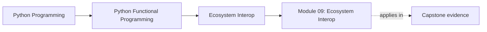
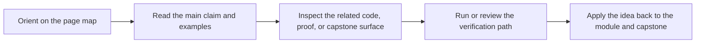

# Module 09: Ecosystem Interop

<!-- page-maps:start -->
## Page Maps

<!-- page-maps:end -->

This module answers a practical adoption question: how do you keep the course’s design
discipline when the code has to touch real libraries, frameworks, data tools, and team
conventions? The answer is not purity theater. It is deliberate interop.

## What this module teaches

- how to use standard-library and third-party tools without surrendering reviewability
- how to wrap imperative libraries behind functional facades
- how to preserve explicit configuration across CLI, service, data, and distributed work
- how to turn team conventions into stable adoption patterns

## Lesson map

- [Standard Library Functional Tools](stdlib-functional-tools.md)
- [Helper Libraries](helper-libraries.md)
- [Data Processing](data-processing.md)
- [Web and Services](web-and-services.md)
- [Data and ML Pipelines](data-and-ml-pipelines.md)
- [CLI and Config Pipelines](cli-and-config-pipelines.md)
- [Distributed Dataflow](distributed-dataflow.md)
- [Functional Facades](functional-facades.md)
- [Cross-Process Composition](cross-process-composition.md)
- [Team Adoption](team-adoption.md)

## Capstone checkpoints

- Identify where FuncPipe prefers stdlib tools over extra abstraction layers.
- Review which external integrations keep configuration and contracts explicit.
- Compare interop wrappers with the core they are protecting.

## Before moving on

You should be able to explain how to adapt real libraries without letting them rewrite the
course’s core architecture.
