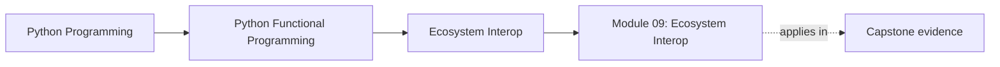
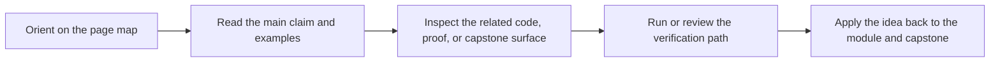

# Module 09: Ecosystem Interop

<!-- page-maps:start -->
## Page Maps

<!-- page-maps:end -->

This module answers a practical adoption question: how do you keep the course’s design
discipline when the code has to touch real libraries, frameworks, data tools, and team
conventions? The answer is not purity theater. It is deliberate interop.

## Learning outcomes

- how to use standard-library and third-party tools without surrendering reviewability
- how to wrap imperative libraries behind functional facades
- how to preserve explicit configuration across CLI, service, data, and distributed work
- how to turn team conventions into stable adoption patterns

## Lesson map

- [Standard Library Functional Tools](stdlib-functional-tools.md)
- [Helper Libraries](helper-libraries.md)
- [Data Processing](data-processing.md)
- [Web and Services](web-and-services.md)
- [Data and ML Pipelines](data-and-ml-pipelines.md)
- [CLI and Config Pipelines](cli-and-config-pipelines.md)
- [Distributed Dataflow](distributed-dataflow.md)
- [Distributed Dataflow Review](distributed-dataflow-review.md)
- [Functional Facades](functional-facades.md)
- [Cross-Process Composition](cross-process-composition.md)
- [Team Adoption](team-adoption.md)
- [Refactoring Guide](refactoring-guide.md)

## Exercises

- Choose one external library boundary and explain which facade keeps configuration and failure contracts explicit.
- Compare one stdlib route with one third-party route and justify which one the capstone should prefer today.
- Review one team convention and state how it becomes a stable engineering standard instead of unwritten folklore.

## Capstone checkpoints

- Identify where FuncPipe prefers stdlib tools over extra abstraction layers.
- Review which external integrations keep configuration and contracts explicit.
- Compare interop wrappers with the core they are protecting.

## Before moving on

You should be able to explain how to adapt real libraries without letting them rewrite the
course’s core architecture. Use [Refactoring Guide](refactoring-guide.md) and compare
against `capstone/_history/worktrees/module-09` before moving forward.

## Closing criteria

- You can explain where interop is a boundary problem rather than a reason to abandon the course’s design rules.
- You can judge whether a wrapper keeps configuration, failure, and review evidence explicit enough for long-term maintenance.
- You can defend a library choice in terms of contracts, not convenience alone.
