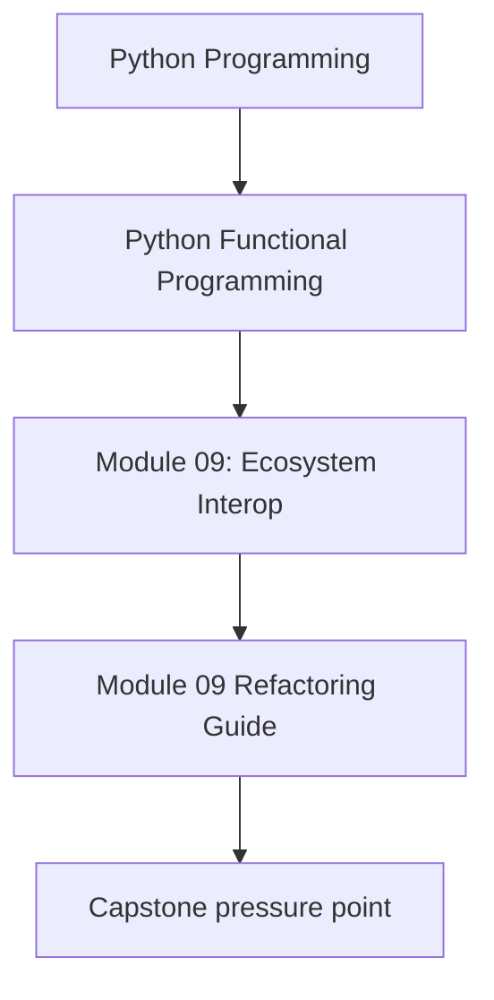
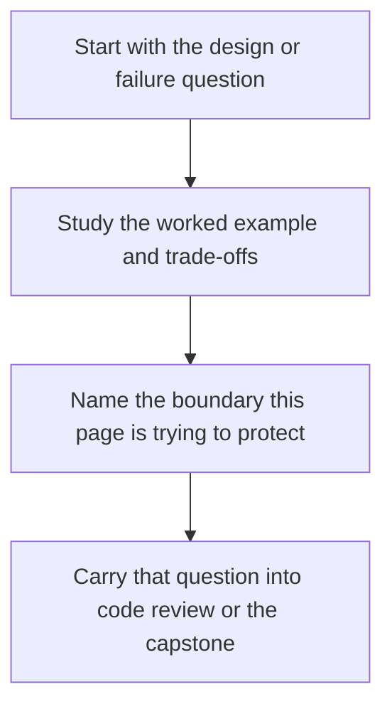

# Module 09 Refactoring Guide

<!-- page-maps:start -->
## Concept Position

<!-- page-maps:end -->

Read the first diagram as a placement map: this page is one concept inside its parent module, not a detached essay, and the capstone is the pressure test for whether the idea holds. Read the second diagram as the working rhythm for the page: name the problem, study the example, identify the boundary, then carry one review question forward.

This guide closes Module 09. The real question is whether the course discipline survives
contact with normal Python libraries, service boundaries, and team conventions.

## Stable comparison route

1. run `make PROGRAM=python-programming/python-functional-programming history-refresh`
2. open `capstone/_history/worktrees/module-09/src/funcpipe_rag/`
3. compare `interop/`, `pipelines/`, and the surrounding core packages they protect
4. read the interop and configured-pipeline tests under `capstone/_history/worktrees/module-09/tests/`

## What to refactor toward

- wrappers that let outside libraries serve the design instead of rewriting it
- explicit configuration through CLI, file, and service surfaces
- adoption patterns a team can repeat without guessing where purity ends
- integration points that stay reviewable because the core contract remains visible

## Exit standard

Before Module 10, you should be able to explain how external tools fit the architecture
without being allowed to define the architecture.
