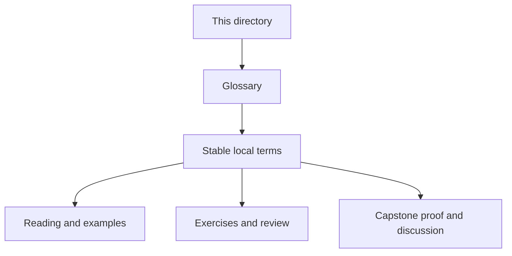
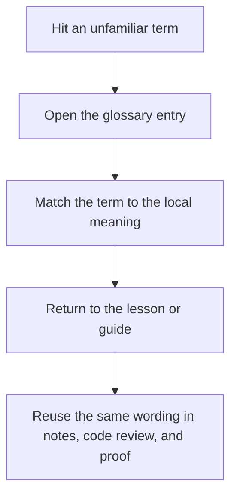

# Module Glossary

<!-- page-maps:start -->
## Glossary Fit

<!-- page-maps:end -->

This glossary belongs to **Module 10: Refactoring, Performance, and Sustainment** in **Python Functional Programming**. It keeps the language of this directory stable so the same ideas keep the same names across reading, practice, review, and capstone proof.

## How to use this glossary

Read the directory index first, then return here whenever a page, command, or review discussion starts to feel more vague than the course intends. The goal is stable language, not extra theory.

## Terms in this directory

| Term | Meaning in this directory |
| --- | --- |
| Advanced Patterns and Scaling | the module's treatment of advanced patterns and scaling, used to make the module's main design claim concrete in design work, refactoring, and capstone evidence. |
| Async Property Testing | the module's treatment of async property testing, used to make the module's main design claim concrete in design work, refactoring, and capstone evidence. |
| Capstone Delivery | the module's treatment of capstone delivery, used to make the module's main design claim concrete in design work, refactoring, and capstone evidence. |
| DDD and FP | the module's treatment of ddd and fp, used to make the module's main design claim concrete in design work, refactoring, and capstone evidence. |
| Governance | the module's treatment of governance, used to make the module's main design claim concrete in design work, refactoring, and capstone evidence. |
| Module 10 Refactoring Guide | the repair route for applying the module's main design claim to existing code without losing behavior, clarity, or proof. |
| Observability | the module's treatment of observability, used to make the module's main design claim concrete in design work, refactoring, and capstone evidence. |
| Performance Budgeting | the module's treatment of performance budgeting, used to make the module's main design claim concrete in design work, refactoring, and capstone evidence. |
| Property-Based Regression | the module's treatment of property-based regression, used to make the module's main design claim concrete in design work, refactoring, and capstone evidence. |
| Systematic Refactor | the module's treatment of systematic refactor, used to make the module's main design claim concrete in design work, refactoring, and capstone evidence. |
| Versioning and Migration | the module's treatment of versioning and migration, used to make the module's main design claim concrete in design work, refactoring, and capstone evidence. |
