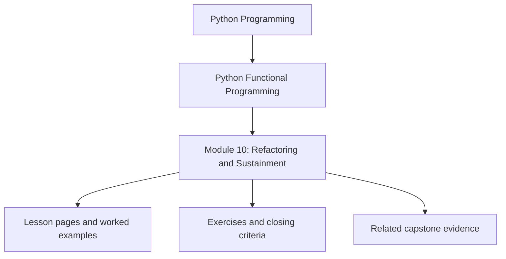
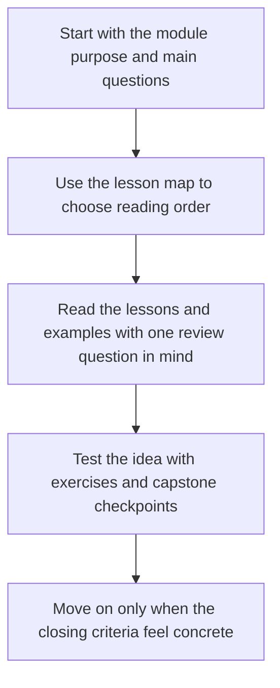

# Module 10: Refactoring, Performance, and Sustainment

<!-- page-maps:start -->
## Module Position

<!-- page-maps:end -->

Read the first diagram as a placement map: this page sits between the course promise, the lesson pages listed below, and the capstone surfaces that pressure-test the module. Read the second diagram as the study route for this page, so the diagrams point you toward the `Lesson map`, `Exercises`, and `Closing criteria` instead of acting like decoration.

## Keep These Pages Open

Use these support surfaces while reading so the final module becomes a review and
sustainment guide instead of one more topic pile at the end of the course:

- [Mastery Map](../module-00-orientation/mastery-map.md) for the late-course review route
- [Review Checklist](../reference/review-checklist.md) for the stable engineering bar
- [Self-Review Prompts](../reference/self-review-prompts.md) for learner-side judgment checks
- [Capstone Review Worksheet](../guides/capstone-review-worksheet.md) for the full claim-to-evidence route through FuncPipe

Carry this question into the module:

> Which design choices still pay for themselves under refactoring, performance pressure, team growth, and long-term review cost?

This module is the long-term survival guide for the course. It focuses on how functional
design choices age under performance pressure, team growth, changing contracts, and the
need to prove behavior over time.

## Learning outcomes

- how to refactor imperative code toward a layered functional design
- how to think about performance, observability, and regression evidence together
- how to evolve contracts, governance, and domain boundaries without losing clarity
- how to judge whether the capstone is ready to be sustained, not only shipped

## Lesson map

- [Systematic Refactor](systematic-refactor.md)
- [Performance Budgeting](performance-budgeting.md)
- [Observability](observability.md)
- [Property-Based Regression](property-based-regression.md)
- [Async Property Testing](async-property-testing.md)
- [Advanced Patterns and Scaling](advanced-patterns-and-scaling.md)
- [DDD and FP](ddd-and-fp.md)
- [Versioning and Migration](versioning-and-migration.md)
- [Governance](governance.md)
- [Capstone Delivery](capstone-delivery.md)
- [Refactoring Guide](refactoring-guide.md)

## Exercises

- Review one refactor proposal and explain what evidence would make it safe to merge instead of merely attractive.
- Pick one performance or observability trade-off and state which contract must remain intact while tuning it.
- Define one governance rule for the capstone and explain which regression or compatibility failure it prevents.

## Capstone checkpoints

- Review whether the codebase has evidence for correctness, not just commentary.
- Inspect where performance trade-offs are explicit instead of accidental.
- Check whether ownership, compatibility, and review standards are documented well enough to last.

## Before finishing the course

You should be able to explain how the capstone can continue evolving without losing the
semantics, boundaries, and review discipline the course spent ten modules building. Use
[Refactoring Guide](refactoring-guide.md) and compare against
`capstone/_history/worktrees/module-10` before you call the course complete.

## Closing criteria

- You can describe how the codebase proves correctness, compatibility, and ownership over time.
- You can judge whether a change proposal improves the system or only moves complexity around.
- You can explain what makes the capstone maintainable two years from now, not only runnable today.
