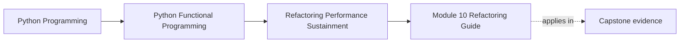
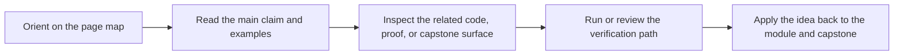

# Module 10 Refactoring Guide

<!-- page-maps:start -->
## Page Maps

<!-- page-maps:end -->

Read the first diagram as a placement map: this page is one concept inside its parent module, not a detached essay, and the capstone is the pressure test for whether the idea holds. Read the second diagram as the working rhythm for the page: name the problem, study the example, identify the boundary, then carry one review question forward.

This guide closes the course. The final standard is sustainment: can the codebase keep
its semantics, evidence, and review discipline while performance pressure and team change
keep arriving.

## Stable comparison route

1. run `make PROGRAM=python-programming/python-functional-programming history-refresh`
2. open `capstone/_history/worktrees/module-10/`
3. compare the live capstone with your understanding of its proof, inspection, and confirmation routes
4. run `make PROGRAM=python-programming/python-functional-programming capstone-confirm` when you need the strongest public route

## What to refactor toward

- performance and observability changes that preserve boundaries instead of bypassing them
- regression evidence that survives refactor and migration work
- governance notes that explain ownership, compatibility, and public review standards
- a capstone that a future maintainer can inspect without reverse-engineering the course

## Exit standard

At the end of the course, you should be able to explain not only what the architecture
is, but how it can evolve without losing the guarantees the earlier modules established.
