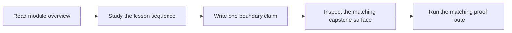
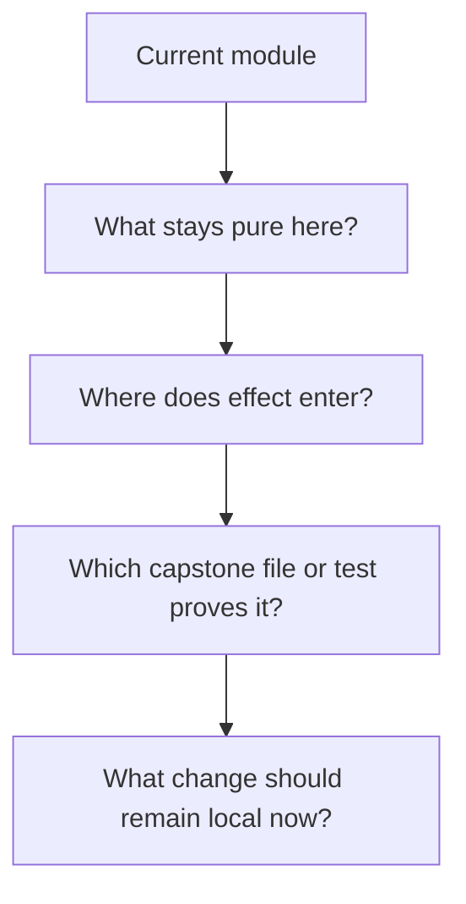

# Practice Map

<!-- page-maps:start -->
## Page Maps

<!-- page-maps:end -->

This page turns the course into a repeatable rehearsal loop. The goal is not only to
finish reading. The goal is to improve judgment under change.

## Recommended rhythm

1. Read the module overview first.
2. Read the lesson sequence in order.
3. Pause after each major concept and write one sentence beginning with: "This boundary exists because..."
4. Inspect the capstone package or guide that expresses that boundary.
5. Run or review the matching executable proof.
6. Rephrase the lesson in terms of change: what becomes easier to refactor or review now?

## Questions that travel across modules

- What is still pure?
- What is now explicit data?
- Where does materialization happen, and why there?
- Which failure shape is visible to the caller?
- Which effectful behavior is controlled by a protocol, shell, or adapter?

## What this prevents

This practice loop prevents passive reading, diagram memorization, and the common mistake
of admiring a functional abstraction without being able to say how it makes the codebase
safer to change.
