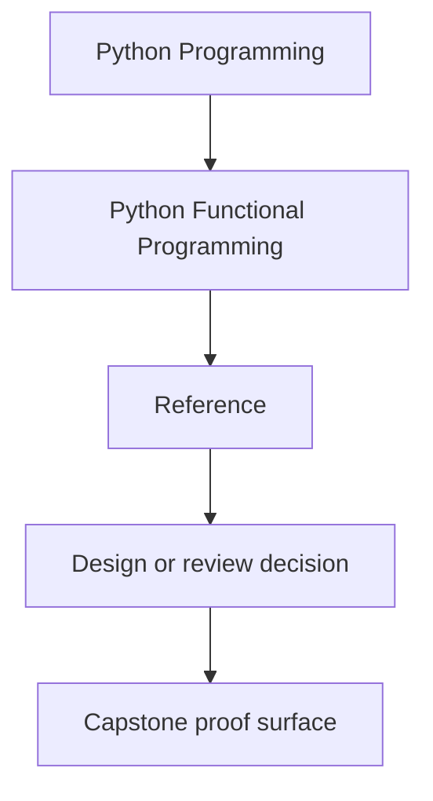
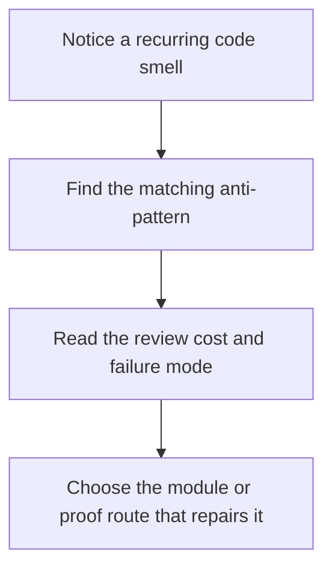

# Functional Anti-Pattern Atlas

<!-- page-maps:start -->
## Reference Position

<!-- page-maps:end -->

Use this page when the code feels harder to reason about but you need a sharper name than
"this seems messy." The course becomes more practical when the bad shapes are named as
clearly as the good ones.

## Hidden effect core

What it looks like:

- business transforms log, fetch, retry, or mutate while pretending to be plain helpers
- tests need patch-heavy setup to isolate supposedly simple logic

Why it is expensive:

- local reasoning disappears
- pure and effectful work can no longer be reviewed separately

Repair route:

- Module 01 for substitution and purity
- Module 07 for effect boundaries and capability discipline

## Configuration by side channel

What it looks like:

- behavior changes because of globals, environment lookups, or ambient module state
- functions claim small signatures while hiding operational inputs elsewhere

Why it is expensive:

- reproducibility drops
- review cannot see which input actually controls the behavior

Repair route:

- Module 02 for configuration as data
- `capstone/src/funcpipe_rag/pipelines/configured.py`

## Decorative laziness

What it looks like:

- generators and iterators are introduced because they seem functional
- execution timing becomes less obvious instead of more controlled

Why it is expensive:

- debugging and cleanup costs rise
- the team cannot tell where work actually happens

Repair route:

- Module 03 for lazy dataflow discipline
- `capstone/tests/unit/streaming/test_streaming.py`

## Failure shape chaos

What it looks like:

- exceptions, sentinel values, booleans, and retries all compete in one flow
- callers have to guess which failure contract applies

Why it is expensive:

- error handling becomes branch archaeology
- retries and reporting stop being reviewable policies

Repair route:

- Module 04 for Result-style failures and retries
- Module 05 for explicit domain states

## Validation drift

What it looks like:

- every caller performs a slightly different check
- illegal states are easy to construct and hard to notice

Why it is expensive:

- the model stops protecting the system
- bug fixes get copied instead of centralized

Repair route:

- Module 05 for algebraic modelling and smart construction
- `capstone/src/funcpipe_rag/fp/validation.py`

## Ceremony-first composition

What it looks like:

- layered containers and higher-order helpers appear before the flow pressure is real
- the abstraction is harder to explain than the imperative version it replaced

Why it is expensive:

- the code becomes less teachable and less debuggable
- "functional style" turns into vocabulary theater

Repair route:

- Module 06 for law-guided composition
- Module 10 for sustainment and governance judgment

## Boundary collapse under interop

What it looks like:

- framework objects leak into the core model
- library convenience starts deciding where domain logic lives

Why it is expensive:

- the functional core becomes hostage to tool choices
- migration and refactoring costs rise quietly

Repair route:

- Module 09 for ecosystem interop discipline
- `capstone/src/funcpipe_rag/interop/`

## Async opacity

What it looks like:

- retries, timeouts, fairness, and backpressure are implicit in runtime behavior
- async code works but nobody can explain the constraints or proof route

Why it is expensive:

- operations and debugging depend on folklore
- concurrency bugs become hard to isolate honestly

Repair route:

- Module 08 for async boundaries and deterministic testing
- `capstone/tests/unit/domain/test_async_backpressure.py`

## Best companion pages

- `review-checklist.md`
- `review-checklist.md`
- `boundary-review-prompts.md`
- `topic-boundaries.md`
