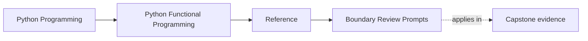
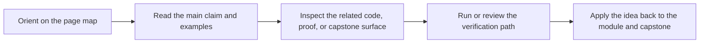

# Boundary Review Prompts

<!-- page-maps:start -->
## Page Maps

<!-- page-maps:end -->

Use this page when the review needs sharper questions than "is this clean?" The most
important functional boundaries in this course are purity, failure shape, effect
placement, and proof visibility.

## Purity boundary prompts

- Which part of this flow is still safely substitutable?
- Which supposedly plain helper still depends on time, I/O, logging, or mutable shared state?
- If I inline this function mentally, does the behavior remain unsurprising?
- Which test proves the boundary is genuinely pure instead of only small?

## Dataflow boundary prompts

- Where is the pipeline shape explicit in data rather than hidden inside branching?
- Which configuration input is controlling behavior, and can I see it in the call surface?
- Where does lazy dataflow become eager, and is that transition deliberate?
- Which value is being transformed, and which layer is only coordinating?

## Failure boundary prompts

- What failure contract does this caller actually receive?
- Are retries, folds, and error reports modeled as policies or scattered as local fixes?
- Would another engineer know when this flow returns data, returns a failure value, or raises?
- Which illegal state is still too easy to construct?

## Effect boundary prompts

- Where does the core stop and effectful coordination begin?
- Could this dependency be expressed as a capability or adapter instead of a direct call?
- Does the current boundary make testing easier or only move complexity outward?
- Which side effect is currently hidden behind a harmless-looking helper?

## Async boundary prompts

- Where is fairness, timeout, or backpressure represented explicitly?
- Which async behavior is visible in tests instead of only in runtime intuition?
- Is concurrency pressure encoded as a contract or inferred from implementation details?
- Would debugging this route require public evidence or private folklore?

## Sustainment boundary prompts

- Is this abstraction still cheaper to review than the code it replaced?
- Which proof route should be run before claiming this refactor preserved the design?
- What would break if the surrounding framework or library changed tomorrow?
- Does this change preserve the course contract, or only preserve functional vocabulary?

## Best companion pages

- `anti-pattern-atlas.md`
- `review-checklist.md`
- `self-review-prompts.md`
- `topic-boundaries.md`
