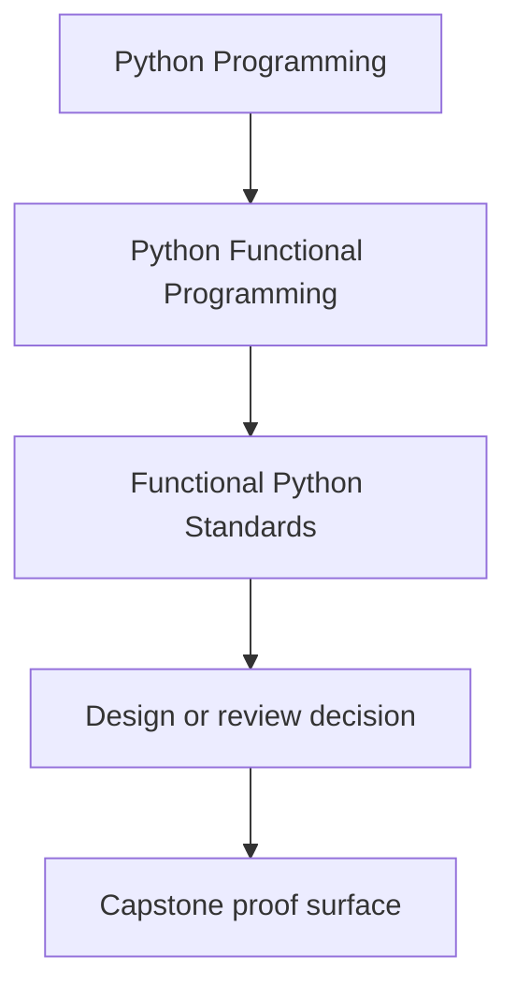
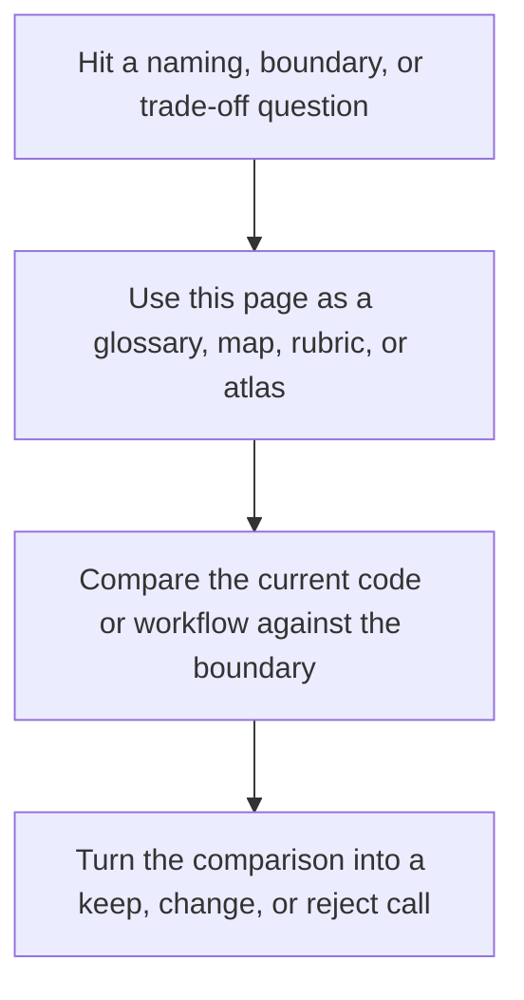

# Functional Python Standards

<!-- page-maps:start -->
## Reference Position

<!-- page-maps:end -->

Read the first diagram as a lookup map: this page is part of the review shelf, not a first-read narrative. Read the second diagram as the reference rhythm: arrive with a concrete ambiguity, compare the current work against the boundary on the page, then turn that comparison into a decision.

These standards capture the default design stance of this course and capstone.

## Core defaults

- Keep the core pure by default; effects belong at explicit boundaries.
- Pass configuration as data instead of reading ambient globals or environment values in the core.
- Prefer small, composable functions over large orchestration blocks.
- Represent expected failures explicitly instead of burying them in broad exception handling.
- Treat laziness, retries, and async coordination as visible contracts, not hidden behavior.

## Package-level expectations

- Keep pure functional helpers in `funcpipe_rag.fp`, `funcpipe_rag.result`, `funcpipe_rag.tree`, and `funcpipe_rag.streaming`.
- Keep domain and pipeline rules in `funcpipe_rag.core`, `funcpipe_rag.rag`, and `funcpipe_rag.policies`.
- Keep concrete effect interpreters in boundary, infrastructure, or shell packages.
- Keep interop layers thin and honest about the libraries they wrap.

## Review defaults

- Prefer standard-library tools such as `itertools`, `functools`, `operator`, and `pathlib` before inventing a new abstraction.
- Name intermediate steps when a pipeline stops being easy to scan.
- Allow loops or eager materialization when they improve clarity or protect performance, but make the boundary explicit.
- Add property-based or law-based tests when a helper claims algebraic guarantees.
