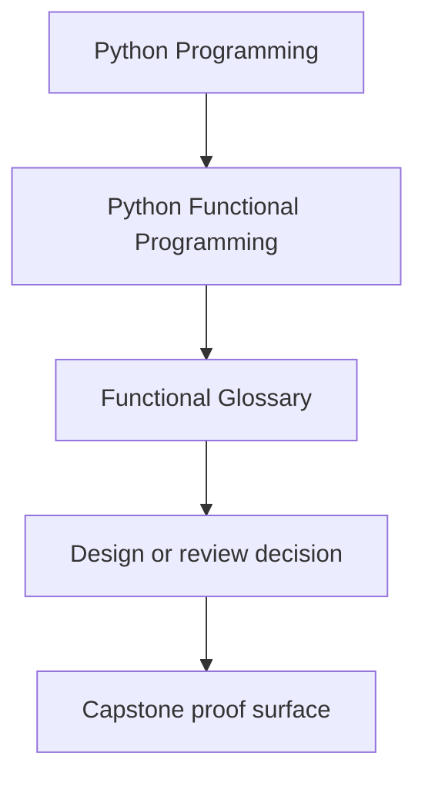
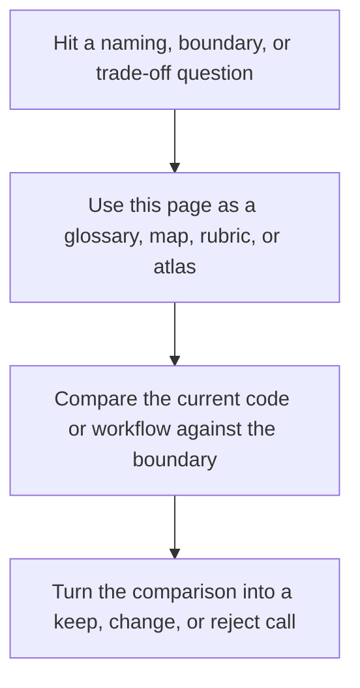

# Functional Glossary

<!-- page-maps:start -->
## Reference Position

<!-- page-maps:end -->

Read the first diagram as a lookup map: this page is part of the review shelf, not a first-read narrative. Read the second diagram as the reference rhythm: arrive with a concrete ambiguity, compare the current work against the boundary on the page, then turn that comparison into a decision.

Use this glossary to keep the course vocabulary stable. Functional programming becomes
harder than it needs to be when the words drift between modules, code review, and the
capstone.

## Core semantics

**purity**
: a function property meaning the result depends only on explicit inputs and the function has no hidden side effects

**referential transparency**
: the substitution rule that lets you replace an expression with its value without changing program behavior

**data-first API**
: an API shape where the primary domain value appears first so functions compose cleanly with partial application and pipelines

**combinator**
: a small function that builds larger behavior by composing functions, iterators, or effectful containers without introducing hidden coordination

**laziness**
: deferred work that happens only when a consumer pulls values, rather than when the pipeline is declared

**idempotence**
: a repeat-safe property where running the same operation again with the same meaningful input leaves the externally visible state unchanged

## Effects and boundaries

**effect boundary**
: the narrow part of the system where I/O, time, randomness, network calls, or process interaction are allowed to occur

**Result**
: an explicit success-or-failure container used when the caller must handle domain or boundary failures without exceptions leaking through the core

**Option**
: an explicit presence-or-absence container used when missing data is normal and should not be conflated with an error

**Reader**
: a context-threading pattern where configuration or dependencies are supplied explicitly from the outside instead of pulled from globals

**Writer**
: a container that returns a value together with accumulated log or trace data while keeping the core computation pure

**State**
: an explicit model for threaded state transitions where each step returns the next state instead of mutating shared objects in place

**backpressure**
: the discipline of letting downstream capacity limit upstream production so a stream does not outrun its consumers

## Proof and review language

**lawfulness**
: the property that a type or combinator obeys its advertised algebraic rules, making refactors safe and composition predictable

**equational reasoning**
: proving behavior by rewriting expressions step by step using definitions and laws instead of depending on intuition alone

**observability**
: the ability to inspect what happened in a pipeline through explicit outputs, traces, or reports instead of hidden print statements or debugger-only state

**capstone evidence**
: the specific code, tests, and proof routes that demonstrate a module claim in the runnable project rather than leaving it as lecture-only theory
