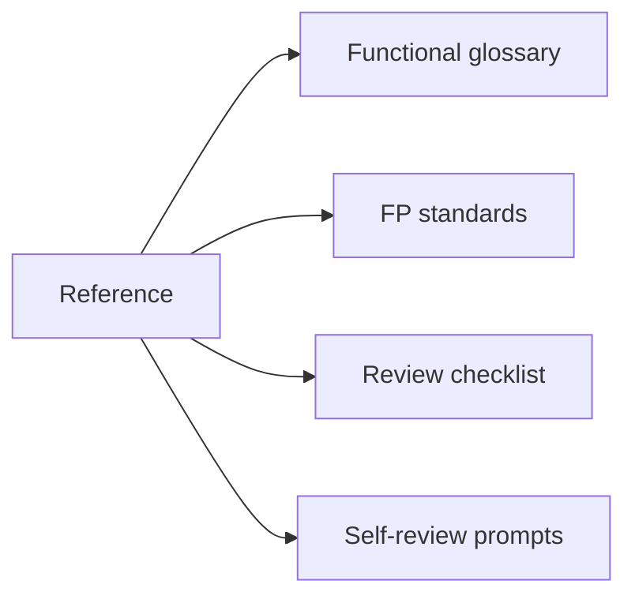
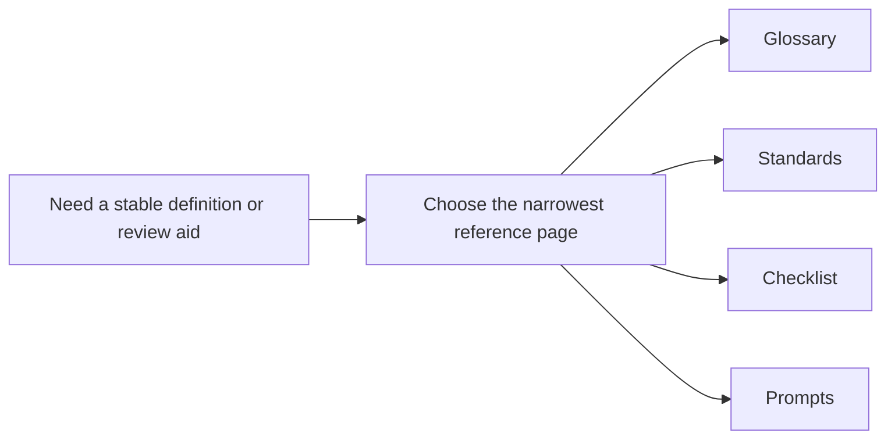

# Reference

<!-- page-maps:start -->
## Page Maps

<!-- page-maps:end -->

Use this section when you need durable language, review criteria, or proof prompts rather
than a reading route. Keep these pages open while designing or reviewing code in the
course or the capstone.

## Pages in this section

- [Functional Glossary](glossary.md) for the course vocabulary that appears across modules and the capstone
- [FP Standards](fp-standards.md) for the stable engineering rules that define acceptable functional design in this course
- [Review Checklist](review-checklist.md) for code review and capstone inspection
- [Self-Review Prompts](self-review-prompts.md) for turning module ideas into retrieval practice and design judgment
- [Topic Boundaries](topic-boundaries.md) for deciding whether a question belongs in the course center, on its edge, or outside it
