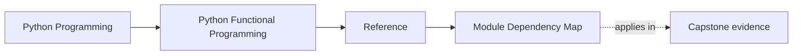
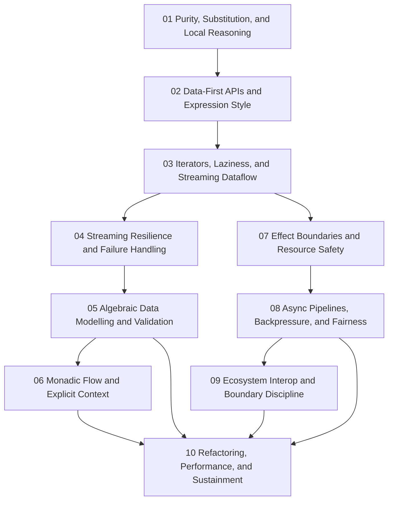

# Module Dependency Map

<!-- page-maps:start -->
## Page Maps

<!-- page-maps:end -->

Use this page when you remember a functional-programming idea but not where it belongs in
the course sequence. The goal is to keep later modules attached to the foundations they
actually depend on.

## Main sequence

## Why the sequence looks like this

| Module | Depends most on | Reason |
| --- | --- | --- |
| 01 | none | purity and substitution are the root of the course's design judgment |
| 02 | 01 | data-first APIs only stay honest when local reasoning is already clear |
| 03 | 01-02 | laziness and iterator pipelines rely on pure, composable steps |
| 04 | 03 | resilient streaming only makes sense once the dataflow is explicit |
| 05 | 01-04 | algebraic modelling and validation need stable pipeline and failure boundaries |
| 06 | 04-05 | explicit context and lawful chaining depend on visible failures and values |
| 07 | 01-06 | effect boundaries matter only after the pure core is legible |
| 08 | 03-07 | async coordination is safest when dataflow and effects are already bounded |
| 09 | 07-08 | interop is a boundary problem after the core and async shells are trustworthy |
| 10 | all earlier modules | sustainment review needs the whole functional design model |

## Fastest safe paths

- new to functional programming: read Modules 01 through 10 in order
- working maintainer: start with Modules 04, 07, 08, and 09, then backfill earlier modules when purity or failure boundaries feel shaky
- FP steward: start with Modules 05, 07, 09, and 10, then return to earlier modules when a boundary or law question points backward
