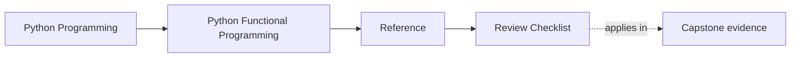
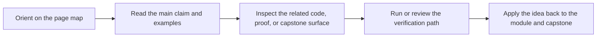

# Review Checklist

<!-- page-maps:start -->
## Page Maps

<!-- page-maps:end -->

Read the first diagram as a lookup map: this page is part of the review shelf, not a first-read narrative. Read the second diagram as the reference rhythm: arrive with a concrete ambiguity, compare the current work against the boundary on the page, then turn that comparison into a decision.

Use this checklist when reviewing course exercises, capstone changes, or production code
influenced by this course.

## Core semantics

- Is the pure core free from hidden I/O, globals, randomness, timestamps, and ambient mutation?
- Are inputs, outputs, and failure shapes explicit enough to reason about locally?
- Are public data structures immutable or at least mutation-disciplined?

## Functional defaults

- Is the core pure by default, with effects kept at explicit boundaries?
- Is configuration passed as data instead of read ambiently inside the core?
- Are standard-library composition tools enough before inventing a new abstraction?
- If clarity required a loop, eager materialization, or a named intermediate step, was that choice made explicit instead of hidden?

## Pipeline design

- Is laziness preserved where it matters, and is materialization a deliberate boundary choice?
- Are retries, buffering, backpressure, or memoization explicit policy choices rather than incidental behavior?
- Does the pipeline read clearly from data source to sink without hidden control flow?

## Effects and boundaries

- Do ports, protocols, or facades define what effectful code is allowed to do?
- Do adapters and shells own execution while the core stays descriptive?
- Are cleanup, idempotency, and retry safety visible in code and tests?

## Evidence

- Do tests prove the most important guarantees, or do they only exercise happy paths?
- Are law-like claims backed by property tests or similarly strong evidence?
- Could another engineer locate the capstone package and test surface that justify the abstraction?
