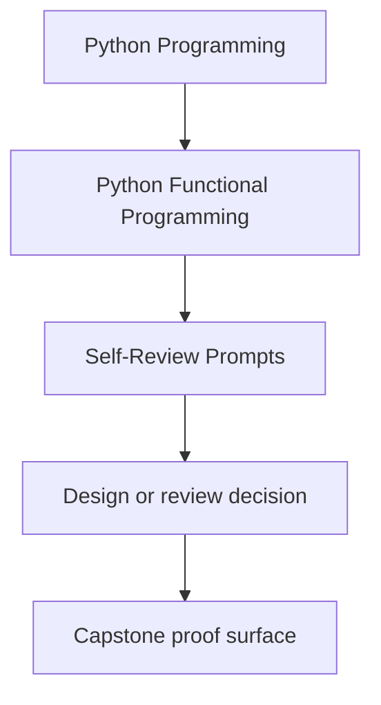
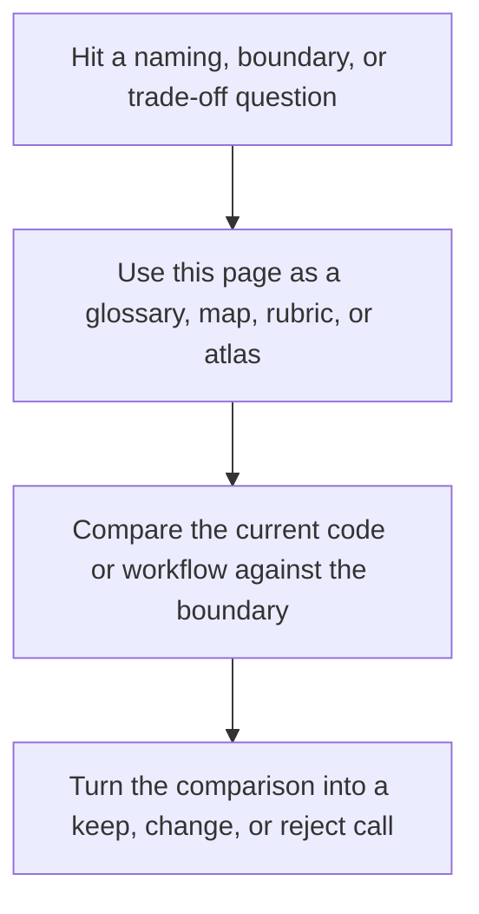

# Self-Review Prompts

<!-- page-maps:start -->
## Reference Position

<!-- page-maps:end -->

Read the first diagram as a lookup map: this page is part of the review shelf, not a first-read narrative. Read the second diagram as the reference rhythm: arrive with a concrete ambiguity, compare the current work against the boundary on the page, then turn that comparison into a decision.

Use these prompts after each module to check whether the course ideas are becoming
operational rather than just familiar.

## Modules 01 to 03

- Can I point to one pure transform and explain exactly why it is substitutable?
- Can I explain where configuration enters the pipeline and why it is not ambient state?
- Can I identify where the system stays lazy and where it must materialize?

## Modules 04 to 06

- Can I explain which failures belong in the data model and which should stop execution?
- Can I justify the modelling choice for one domain value instead of calling it taste?
- Can I trace one lawful chain and explain why regrouping it will not change behavior?

## Modules 07 to 08

- Can I name the capability or protocol that protects one effectful boundary?
- Can I explain where cleanup happens and how retries avoid making the situation worse?
- Can I show where async work is described and where it is actually driven?

## Modules 09 to 10

- Can I explain why an interop layer preserves the core model instead of eroding it?
- Can I point to evidence for one performance or observability claim?
- Can I explain how this codebase could evolve without losing its design contracts?
