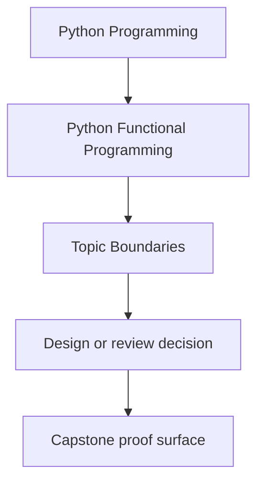
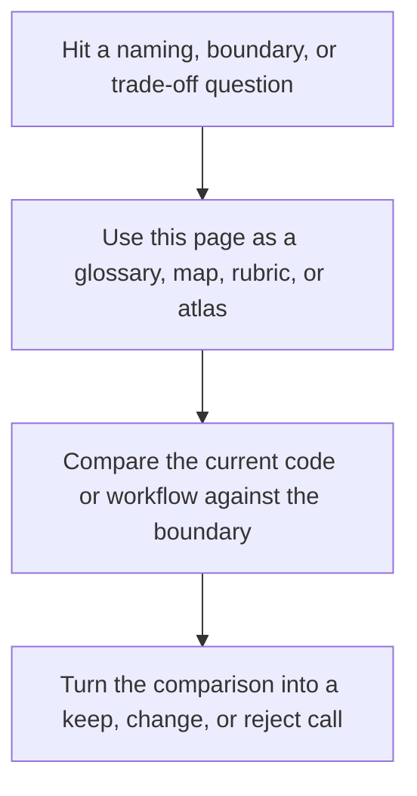

# Topic Boundaries

<!-- page-maps:start -->
## Reference Position

<!-- page-maps:end -->

Read the first diagram as a lookup map: this page is part of the review shelf, not a first-read narrative. Read the second diagram as the reference rhythm: arrive with a concrete ambiguity, compare the current work against the boundary on the page, then turn that comparison into a decision.

Use this page when you need to decide whether a topic belongs inside the center of
this course, on its edge, or outside it. That boundary matters because “functional
programming in Python” becomes vague fast when every adjacent abstraction is treated as
core curriculum.

## What this course is centrally about

These topics are the spine of the course:

- purity, substitution, and value semantics as the basis for safe refactoring
- data-first APIs, higher-order composition, and laziness for pipeline construction
- explicit error and absence modeling with `Result`, `Option`, and law-guided composition
- effect boundaries, capabilities, and resource safety so side effects stay owned and reviewable
- observability, retries, reports, and async backpressure as functional design pressures rather than ad hoc patches
- capstone proof discipline: module claims tied to code paths, tests, and review standards

If a question changes whether a pipeline remains composable, testable, or honest about
effects, it belongs in the center of this course.

## Topics that are adjacent, not central

These matter, but they are supporting material rather than the main teaching target:

- type-checker details beyond what is needed to keep the API and laws reviewable
- category-theory vocabulary beyond the minimum needed to explain the laws in use
- RAG, web, CLI, async, or data tooling specifics beyond the way they pressure functional design
- third-party library catalogs beyond the adapters and comparison points used in Module 09
- advanced performance work once the data flow and ownership model are already correct

The course should mention these when they affect design choices, but it should not turn
into a theory survey, framework catalog, or domain primer.

## Topics that are outside the course center

These are not the main subject here:

- beginner Python syntax, loops, or function basics
- full Haskell-style abstraction breadth or language-specific ecosystem depth
- compiler implementation, parsing theory, or formal semantics beyond practical law-guided reasoning
- distributed systems operations, cluster scheduling, or infrastructure administration
- machine learning fundamentals unrelated to the functional discipline of the capstone

Those topics can matter in real work, but they are not where this course should spend
most of its depth budget.

## Common boundary confusions

| Confusion | Better boundary |
| --- | --- |
| “Functional programming means using `map` and `filter` everywhere.” | Functional programming here means explicit data flow, owned effects, and refactor-safe composition. |
| “The RAG capstone is really a machine learning course.” | The capstone uses RAG as pressure; the subject is the functional architecture around it. |
| “Monads are the main goal.” | The main goal is disciplined composition; monadic helpers are one tool in that discipline. |
| “Async and streaming are separate performance topics.” | They belong here when they change composition laws, backpressure, and effect ownership. |
| “A third-party FP library is the curriculum.” | Libraries are comparison points and optional aids, not the center of the course. |

## How to use this boundary in practice

- Stay in this course when the question is “does this design preserve purity or make effects explicit?”
- Stay in this course when the question is “does this combinator or container keep composition laws reviewable?”
- Use an adjacent source when the question is mostly vendor APIs, framework setup, or theory breadth.
- Leave the course center when the question is beginner Python, general ML, or large-scale infrastructure operations.

The course becomes easier to trust when its boundary is explicit. That clarity is what
keeps the module sequence coherent instead of feeling like a bag of unrelated advanced
Python topics.
