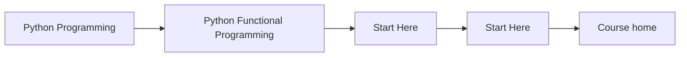
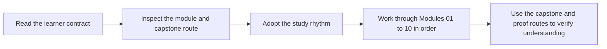

# Start Here

<!-- page-maps:start -->
## Page Maps

<!-- page-maps:end -->

This is the shortest honest route into the course. Read it before you start browsing
module pages. The subject is not functional syntax by itself. The subject is how to make
Python codebases easier to reason about by turning purity, dataflow, failures, and
effects into explicit contracts.

## What this course is really teaching

The course teaches functional programming in Python as a discipline of boundary control:

- what should stay pure
- what should become explicit data
- where effects should enter
- how a pipeline should remain inspectable under growth

If you keep those questions in view, the modules feel cumulative instead of decorative.

## Best reading route

1. Read [Course Home](index.md) for the course promise and module arc.
2. Read [Orientation](module-00-orientation/index.md), [Course Orientation](module-00-orientation/course-orientation.md), and [How to Study This Course](module-00-orientation/how-to-study-this-course.md).
3. Read [Course Guide](course-guide.md) to understand the course structure.
4. Read [Learning Contract](learning-contract.md) before Module 01.
5. Keep [FuncPipe Capstone Guide](capstone.md) open while reading the full course.
6. Use [Command Guide](command-guide.md) and [Capstone Map](capstone-map.md) when you want the executable route.

## What to avoid

- treating purity as an aesthetic preference instead of a local reasoning contract
- treating laziness, retries, or async work as magic instead of explicit control surfaces
- reading advanced modules without checking what evidence in the capstone supports them
- admiring abstractions that make the code harder to debug than the imperative baseline

## Success signal

You are using the course correctly if each module helps you answer one question more
clearly in the capstone: what is still pure, where effects begin, and why that boundary
is easier to review than the alternatives.
