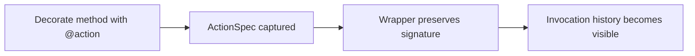
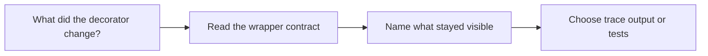

# Action Guide

<!-- page-maps:start -->
## Guide Maps

<!-- page-maps:end -->

Use this guide when the decorator layer feels useful but too magical. The goal is to make
the action wrapper explicit about what metadata it adds and what callable shape it preserves.

## What the action wrapper owns

| Responsibility | Owning surface |
| --- | --- |
| action summary and signature capture | `ActionSpec` in `actions.py` |
| preserved wrapped metadata | `functools.wraps` and `wrapped.__signature__` |
| recorded invocation history | `wrapped()` appending to `_action_history` |
| manifest-visible action metadata | `ActionSpec.manifest()` |

## What the action wrapper should not own

- plugin registration policy
- descriptor storage and coercion
- CLI argument parsing
- concrete delivery payload semantics

## Best code route

1. `ActionSpec`
2. `action()`
3. one concrete wrapped method in `plugins.py`
4. `trace` output for the visible runtime consequence

## Best proof surfaces

- `tests/test_registry.py` for preserved signatures and wrapped metadata
- `tests/test_runtime.py` for recorded action history
- `make action` when the question is one concrete exported action contract
- `TRACE_GUIDE.md` when the public trace route is the clearest surface

## Best companion guides

- read [TRACE_GUIDE.md](TRACE_GUIDE.md) when the wrapper question is mainly about visible runtime history
- read [PLUGIN_CATALOG.md](PLUGIN_CATALOG.md) when you want one concrete plugin action as the example
- read [PACKAGE_GUIDE.md](PACKAGE_GUIDE.md) when you want the file route around the decorator layer
