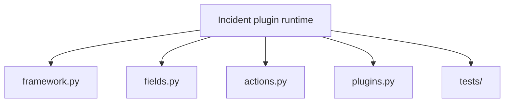

# Capstone Architecture

<!-- page-maps:start -->
## Guide Maps



```mermaid
flowchart LR
  classDef["Class definition"] --> meta["PluginMeta collects fields and actions"]
  meta --> registry["Registry stores plugin classes"]
  registry --> manifest["Manifest exposes runtime shape"]
  manifest --> invoke["Invocation creates plugin instances and runs actions"]
```
<!-- page-maps:end -->

This capstone is intentionally small, but its architecture is strict. Each file owns one
layer of the runtime so the learner can see where class-definition behavior ends and
runtime behavior begins.

## Architectural boundaries

### `framework.py`

Owns class creation, generated constructor signatures, plugin registration, manifest export,
and the public invocation helpers.

### `fields.py`

Owns descriptor-backed configuration semantics and field metadata.

### `actions.py`

Owns action wrapping, signature preservation, and invocation-history recording.

### `plugins.py`

Owns concrete delivery adapters that make the abstractions tangible.

## Design rules

- manifest export must not execute plugin actions
- registration must be deterministic and resettable in tests
- field validation must happen where attribute ownership is explicit
- action wrapping must preserve the function shape visible to tooling

## Why this architecture is pedagogic

The files are separated by mechanism rather than by framework convention alone. That
lets the learner ask, file by file, which behavior belongs to a field, a wrapper, a
metaclass, or ordinary runtime code.
