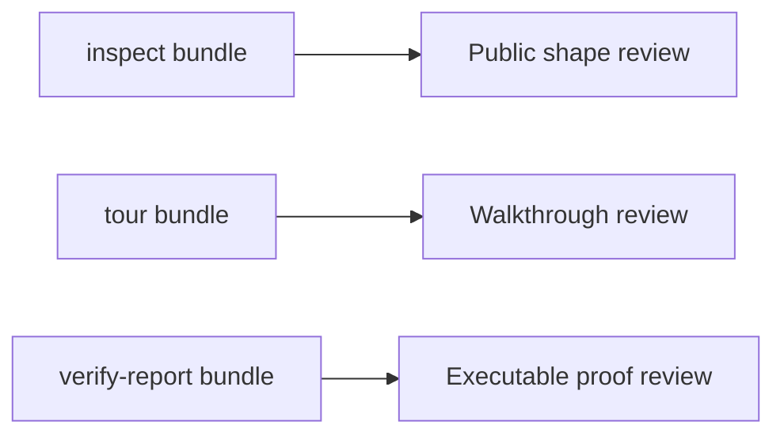
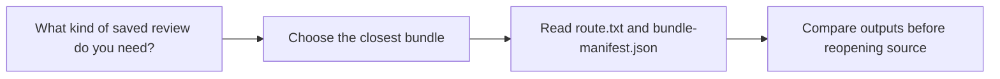

# Bundle Guide

<!-- page-maps:start -->
## Guide Maps

<!-- page-maps:end -->

Use this guide when the capstone's saved artifacts are useful but the directory-level
review story is still fuzzy. The goal is to make the three bundle routes feel like one
coherent proof shelf.

## Bundles at a glance

| Bundle | Built by | Best use |
| --- | --- | --- |
| inspect bundle | `make inspect` | review public manifest, registry, plugin, and signature shape without invocation |
| tour bundle | `make tour` | review one saved learner-facing route from public shape into concrete invocation and trace |
| verify-report bundle | `make verify-report` | review executable proof together with saved public-surface evidence |

## What the bundle manifest adds

Each bundle also includes `bundle-manifest.json`, which records:

- file paths
- file sizes
- SHA-256 hashes

That manifest is useful when you want to confirm exactly what the saved review route
produced without diffing every file manually.

## Best companion guides

- read [INSPECTION_GUIDE.md](INSPECTION_GUIDE.md) when the inspect bundle is the right route but one artifact is still unclear
- read [WALKTHROUGH_GUIDE.md](WALKTHROUGH_GUIDE.md) when the tour bundle is the right route
- read [PROOF_GUIDE.md](PROOF_GUIDE.md) when the verify-report bundle is the right route
