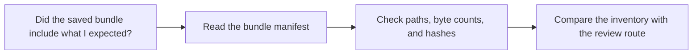

# Bundle Manifest Guide

<!-- page-maps:start -->
## Guide Maps

<!-- page-maps:end -->

Use this guide when the capstone's saved bundles are helpful but you need a precise
inventory of what was written. The goal is to make bundle review reproducible without
opening every file manually.

## What the bundle manifest owns

| Responsibility | Owning surface |
| --- | --- |
| enumerating saved bundle files in stable path order | `scripts/write_bundle_manifest.py` |
| recording file sizes for review bundles | `bundle-manifest.json` |
| recording SHA-256 hashes for saved artifacts | `bundle-manifest.json` |

## Best proof surfaces

- `tests/test_bundle_manifest.py` for executable proof that the inventory stays stable
- `make inspect`, `make tour`, and `make verify-report` when you want real saved bundles
- `BUNDLE_GUIDE.md` when you need to choose the right saved bundle first

## Best companion guides

- read [BUNDLE_GUIDE.md](BUNDLE_GUIDE.md) when the question is which saved route to build
- read [INSPECTION_GUIDE.md](INSPECTION_GUIDE.md) when the next question is the content of the inspect bundle
- read [PROOF_GUIDE.md](PROOF_GUIDE.md) when the next question is the strongest saved proof route
