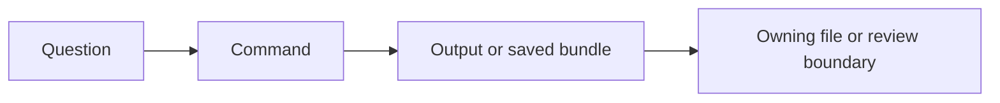
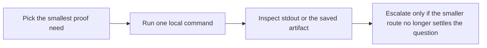

# Command Guide

<!-- page-maps:start -->
## Guide Maps

<!-- page-maps:end -->

Use this guide when you are already inside `capstone/` and need the smallest honest local
command. The goal is not command memorization. The goal is keeping proof proportional to
the question you are trying to answer.

## Stable local commands

| Command | What it is for | What it gives you |
| --- | --- | --- |
| `make manifest` | inspect exported plugin schema without invocation | public manifest JSON |
| `make plugin` | inspect one concrete plugin contract | one plugin contract JSON |
| `make field` | inspect one descriptor-backed field contract | one field contract JSON |
| `make action` | inspect one decorator-backed action contract | one action contract JSON |
| `make registry` | inspect registration determinism from the public surface | registry JSON |
| `make signatures` | inspect generated constructor and action signatures | signature JSON |
| `make demo` | invoke one realistic action | one invocation result |
| `make trace` | inspect one invocation with configuration and history | trace JSON |
| `make inspect` | build the saved inspection bundle | bundle under `artifacts/inspect/...` |
| `make tour` | build the saved walkthrough bundle | bundle under `artifacts/tour/...` |
| `make verify-report` | build the saved executable verification bundle | bundle under `artifacts/review/...` |
| `make confirm` | run the strongest local executable confirmation route | pytest success or failure |
| `make proof` | build the full learner-facing proof route | all saved bundles together |

## Start by proof size

### Smallest observational routes

Use these when the question is about public runtime shape:

- `make manifest`
- `make plugin`
- `make field`
- `make action`
- `make registry`
- `make signatures`

### One concrete behavior

Use these when the question is about one realistic invocation:

- `make demo`
- `make trace`

### Saved review surfaces

Use these when you need artifacts you can inspect later:

- `make inspect`
- `make tour`
- `make verify-report`

### Strongest confirmation

Use these when you need the broadest local confidence:

- `make confirm`
- `make proof`

## Artifact locations

- `make inspect` writes to `../../../../artifacts/inspect/python-programming/python-meta-programming`
- `make tour` writes to `../../../../artifacts/tour/python-programming/python-meta-programming`
- `make verify-report` writes to `../../../../artifacts/review/python-programming/python-meta-programming`

## Best companion guides

- `GUIDE_INDEX.md`
- `TARGET_GUIDE.md`
- `PROOF_GUIDE.md`
- `TEST_GUIDE.md`
