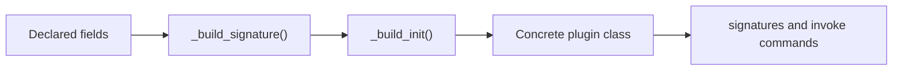

# Constructor Guide


<!-- page-maps:start -->
## Guide Maps



```mermaid
flowchart LR
  question["How does a plugin get its constructor?"] --> constructor["Read the generated constructor contract"]
  constructor --> inspect["Compare signature inspection and instance creation"]
  inspect --> source["Return to framework.py and tests/test_registry.py"]
```
<!-- page-maps:end -->

Use this guide when the capstone's constructor signatures look helpful but still feel
like metaclass magic. The goal is to make generated initialization and generated
signatures concrete enough to reason about and verify.

## What the generated constructor owns

| Responsibility | Owning surface |
| --- | --- |
| turning declared fields into keyword-only parameters | `_build_signature()` in `framework.py` |
| creating the default concrete `__init__` implementation | `_build_init()` in `framework.py` |
| binding provided keyword arguments before field initialization | generated `__init__` closure in `framework.py` |
| exposing the public call shape for inspection tools | `cls.__signature__` and `make signatures` |

## What the generated constructor should not own

- descriptor coercion rules themselves
- action wrapper metadata
- registry ordering policy
- concrete plugin behavior

## Read this with the right comparison

- compare field declarations in `plugins.py` with `inspect.signature(plugin_cls)` output
- compare constructor binding in `_build_init()` with `Field.initialize()`
- compare `make signatures` with `tests/test_registry.py`

## Best proof surfaces

- `make signatures` when you want the public call shape
- `tests/test_registry.py` when you want executable proof that field declarations become the expected constructor
- `framework.py` when you need the exact metaclass-owned implementation path

## Best companion guides

- read [DEFINITION_TIME_GUIDE.md](DEFINITION_TIME_GUIDE.md) when the broader class-definition sequence is still unclear
- read [FIELD_GUIDE.md](FIELD_GUIDE.md) when the next question is what happens after a bound constructor value reaches a descriptor
- read [ACTION_GUIDE.md](ACTION_GUIDE.md) when the next question is generated action signatures rather than generated constructors
