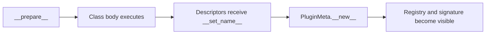
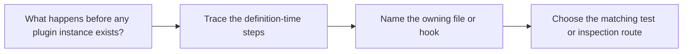

# Definition Time Guide

<!-- page-maps:start -->
## Guide Maps

<!-- page-maps:end -->

Use this guide when the capstone's runtime seems clear but the class-definition behavior
still feels like hidden magic. The goal is to make the definition-time sequence explicit
before you reason about invocation.

## Definition-time sequence

1. `PluginMeta.__prepare__` returns `DefinitionNamespace`.
2. The class body executes and places fields and wrapped actions into that namespace.
3. Descriptors receive `__set_name__` and learn their storage keys.
4. `PluginMeta.__new__` gathers inherited and local fields and action specs.
5. A constructor signature is generated from the collected fields.
6. Concrete plugins receive their group and public plugin name.
7. Concrete plugins are registered in the deterministic runtime registry.

## Why this matters

- duplicate tracked members are rejected during class-body execution
- descriptors become meaningful before instance creation because names and storage keys are fixed
- generated constructor signatures make field declarations visible to tooling
- manifest and registry output depend on definition-time work staying deterministic

## Best proof surfaces

- `tests/test_registry.py` for constructor signatures, duplicate protection, and wrapped metadata
- `manifest` and `registry` output for the public consequences of definition-time work
- `framework.py` and `fields.py` for the owning implementation path

## Best companion guides

- read [PLUGIN_RUNTIME_GUIDE.md](PLUGIN_RUNTIME_GUIDE.md) when the terms are still fuzzy
- read [CONSTRUCTOR_GUIDE.md](CONSTRUCTOR_GUIDE.md) when generated `__init__` and signature behavior needs its own explanation
- read [PACKAGE_GUIDE.md](PACKAGE_GUIDE.md) when you want the file route for the same sequence
- read [PROOF_GUIDE.md](PROOF_GUIDE.md) when you want the command route after the sequence is clear
