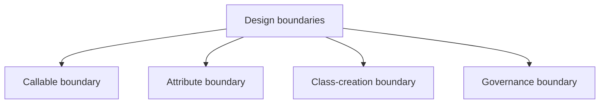
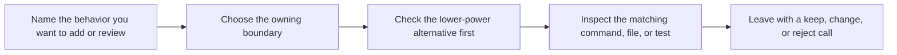

# Design Boundaries

<!-- page-maps:start -->
## Guide Maps

<!-- page-maps:end -->

Use this guide when the capstone technically makes sense but you still need to know why
each mechanism owns the behavior it owns. The goal is to keep the capstone small, honest,
and reviewable instead of letting it drift into "the framework can do anything."

## Callable boundary

**Owner:** `actions.py`

This boundary owns:

- action wrapping
- preserved signatures and metadata
- action-history recording

This boundary does not own:

- field validation
- class registration
- manifest assembly

Reject or redesign when:

- the wrapper starts reaching into per-instance storage
- retry, caching, or validation policy swallows the original callable contract
- reviewers can no longer tell what the wrapped action really accepts

## Attribute boundary

**Owner:** `fields.py`

This boundary owns:

- descriptor-backed configuration rules
- coercion and validation for one field
- field metadata exported through the manifest

This boundary does not own:

- plugin registration
- action invocation behavior
- broad orchestration policy

Reject or redesign when:

- a descriptor starts owning behavior that is not really about attribute access
- per-instance state leaks across instances
- field objects begin to look like a hidden framework layer

## Class-creation boundary

**Owner:** `framework.py`

This boundary owns:

- plugin registration
- generated constructor signatures
- manifest assembly from declared fields and actions

This boundary does not own:

- concrete delivery behavior
- descriptor coercion details
- invocation history recording

Reject or redesign when:

- the metaclass exists only because it feels powerful
- a class decorator or explicit registration step could own the same rule more honestly
- class-definition work becomes surprising, heavy, or untestable

## Governance boundary

**Owners:** `cli.py`, tests, and the proof guides

This boundary owns:

- public inspection and invocation routes
- saved review bundles
- executable confirmation through tests

This boundary does not own:

- private magic that cannot be reached from the public surface
- unreviewable import-time tricks
- dynamic execution hidden from ordinary inspection routes

Reject or redesign when:

- the runtime becomes easier to use than to observe
- debugging now requires folklore instead of public commands and tests
- the proof route no longer matches the design claims the capstone is teaching

## Best companion guides

- `ARCHITECTURE.md`
- `PACKAGE_GUIDE.md`
- `MECHANISM_SELECTION_GUIDE.md`
- `EXTENSION_GUIDE.md`
- `TEST_GUIDE.md`
