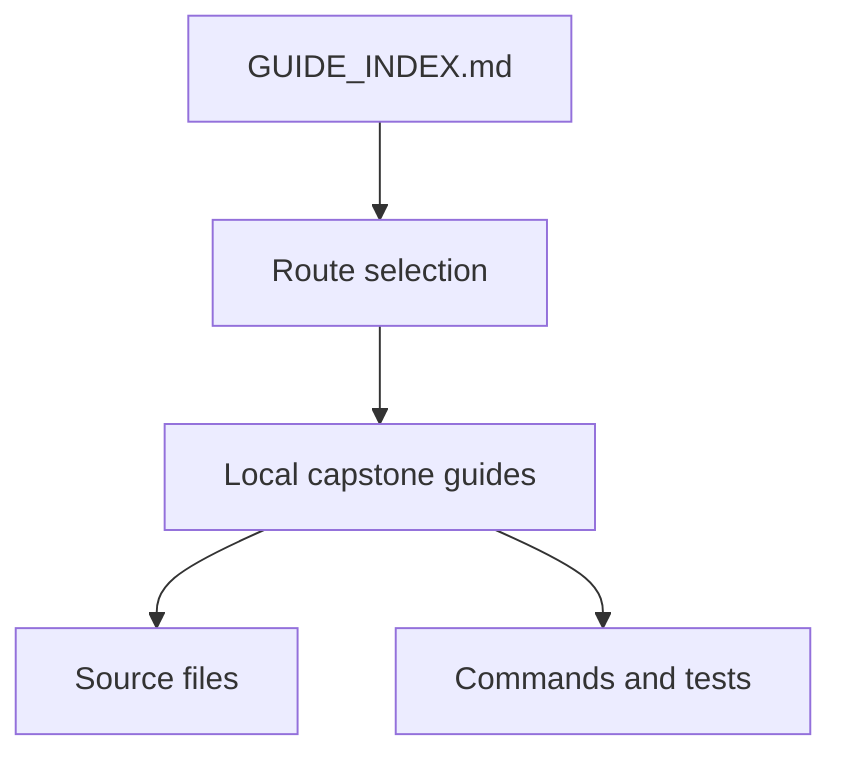
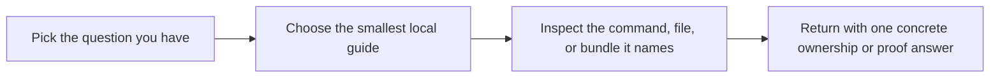

# Guide Index

<!-- page-maps:start -->
## Guide Maps

<!-- page-maps:end -->

Use this page when the capstone root shows many guide files and you need one durable
starting point. The goal is not to read every document. The goal is to open the smallest
local guide that matches the question you actually have.

## Start here by question

### "What is this project, and how should I enter it?"

- `README.md`
- `GUIDE_INDEX.md`
- `PLUGIN_RUNTIME_GUIDE.md`

### "Which file owns which mechanism?"

- `ARCHITECTURE.md`
- `PACKAGE_GUIDE.md`
- `SOURCE_GUIDE.md`

### "Which command should I run first?"

- `TARGET_GUIDE.md`
- `README.md`

### "How do I inspect the public runtime shape?"

- `MANIFEST_GUIDE.md`
- `REGISTRY_GUIDE.md`
- `INSPECTION_GUIDE.md`

### "How do wrappers, fields, and constructors work?"

- `ACTION_GUIDE.md`
- `FIELD_GUIDE.md`
- `CONSTRUCTOR_GUIDE.md`
- `DEFINITION_TIME_GUIDE.md`

### "How do I review or extend the project safely?"

- `PROOF_GUIDE.md`
- `TEST_GUIDE.md`
- `EXTENSION_GUIDE.md`
- `MECHANISM_SELECTION_GUIDE.md`

### "How do I read the saved review bundles?"

- `BUNDLE_GUIDE.md`
- `BUNDLE_MANIFEST_GUIDE.md`
- `WALKTHROUGH_GUIDE.md`
- `TOUR.md`

## Best next files after the guide index

1. `README.md`
2. `ARCHITECTURE.md`
3. `TARGET_GUIDE.md`
4. `PACKAGE_GUIDE.md`

That route gives the learner the project promise, the ownership model, the command route,
and the file route before they drop into code.
