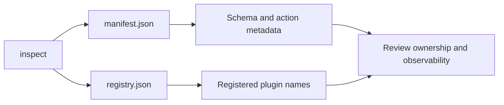
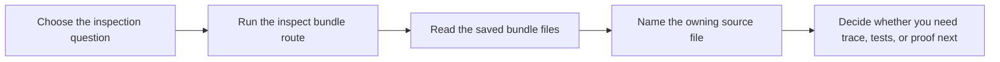

# Inspection Guide

<!-- page-maps:start -->
## Guide Maps

<!-- page-maps:end -->

Use this guide when you want to inspect what the runtime exposes without immediately
executing one plugin action. The goal is to make manifest and registry review explicit
instead of letting them blur into invocation proof.

## Which output answers which question

| Output | Best question |
| --- | --- |
| `manifest.json` | what field and action metadata are publicly visible |
| `registry.json` | which concrete plugins are actually registered |
| `plugin.json` | what one concrete plugin contract looks like end to end |
| `signatures.json` | what generated constructor and action signatures are publicly visible |
| `route.txt` | what to read next in the saved review order |
| `manifest.json` in the bundle manifest | whether the saved bundle inventory is complete and stable |

## Recommended reading order

1. Run `make inspect`.
2. Read `manifest.json`.
3. Read `registry.json`.
4. Read `plugin.json`.
5. Read `signatures.json`.
6. Read `route.txt`.
7. Follow the linked local guides only after you can state what the public surface shows.

## What this route should teach

- the manifest is observational metadata, not a hidden invocation channel
- the registry is a runtime fact you can inspect directly rather than infer from imports
- one concrete plugin contract can be reviewed without jumping straight to invocation
- generated signatures are part of the public review surface rather than a private implementation detail
- public inspection can stay useful even before you know every internal class and hook

## Best follow-up choices

- Go to `TARGET_GUIDE.md` when you need the next smallest command.
- Go to `WALKTHROUGH_GUIDE.md` when you need one concrete invocation story.
- Go to `TEST_GUIDE.md` when you need precise executable proof for a claim the bundle only suggests.
- Go to `PROOF_GUIDE.md` when you need the strongest review route.
- Go to `REGISTRY_GUIDE.md` when the next question is why a plugin is or is not registered at all.

## What this guide prevents

- mistaking manifest output for proof of successful invocation
- treating registry state as if it were enough to justify the full runtime design
- opening framework internals before you can explain the public inspection surface
