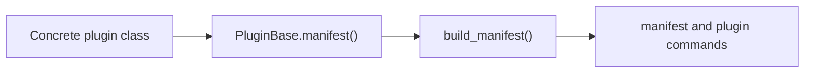
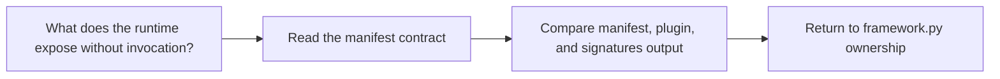

# Manifest Guide

<!-- page-maps:start -->
## Guide Maps

<!-- page-maps:end -->

Use this guide when the capstone's manifest still feels like vague introspection output.
The goal is to make the manifest a named observational surface instead of a magic JSON
dump.

## What the manifest owns

| Responsibility | Owning surface |
| --- | --- |
| exporting one concrete plugin contract | `PluginBase.manifest()` |
| exporting a whole group of concrete plugins | `build_manifest()` |
| keeping field schema and action metadata observable | `fields.py` specs and `actions.py` specs as consumed by `framework.py` |
| public manifest inspection | `make manifest` and `make plugin` |

## What the manifest should not own

- plugin registration decisions
- field coercion side effects
- action invocation results
- action-history recording

## Best proof surfaces

- `make manifest` when you want the smallest public export route
- `make plugin` when you want one concrete contract instead of the whole group
- `tests/test_cli.py` when you want executable proof that the CLI surface stays stable

## Best companion guides

- read [REGISTRY_GUIDE.md](REGISTRY_GUIDE.md) when the next question is which plugins exist before export
- read [FIELD_GUIDE.md](FIELD_GUIDE.md) when the manifest question becomes a field-schema question
- read [ACTION_GUIDE.md](ACTION_GUIDE.md) when the manifest question becomes an action-signature question
- read [TRACE_GUIDE.md](TRACE_GUIDE.md) when you need executed behavior instead of observational metadata
