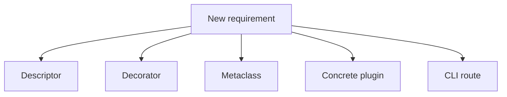
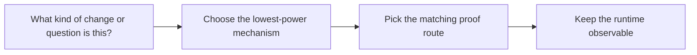

# Mechanism Selection Guide

<!-- page-maps:start -->
## Guide Maps

<!-- page-maps:end -->

Use this guide when the capstone's mechanisms are individually clear but you still need
help choosing the right one. The goal is to keep metaprogramming justified, not merely
possible.

## Choose the lowest-power honest mechanism

| If the requirement is about... | Prefer this mechanism | First owning surface |
| --- | --- | --- |
| configuration validation, defaults, or schema metadata | descriptor | `fields.py` |
| invocation metadata, preserved signatures, or action history | decorator | `actions.py` |
| class registration, generated constructors, or manifest assembly | metaclass or framework helper | `framework.py` |
| one concrete adapter behavior | ordinary plugin class | `plugins.py` |
| one public inspection or invocation route | CLI command | `cli.py` |

## Escalation rules

1. Start with a concrete plugin change before touching the framework.
2. Use a descriptor only when the rule belongs to attribute ownership, not general plugin orchestration.
3. Use a decorator only when the behavior belongs to a callable boundary, not stored configuration.
4. Touch the metaclass only when class-definition-time behavior must change for every concrete plugin.
5. Add a CLI route only when an existing public command cannot expose the needed proof surface honestly.

## Strong pairings

- pair descriptors with `make field` and `tests/test_fields.py`
- pair decorators with `make action`, `make trace`, and runtime tests
- pair metaclass changes with `make registry`, `make signatures`, and `tests/test_registry.py`
- pair plugin changes with `make plugin`, `make demo`, and runtime tests
- pair CLI changes with `tests/test_cli.py` and the closest saved bundle route

## What this guide prevents

- reaching for the metaclass when a plugin or descriptor would be clearer
- putting runtime behavior into the manifest or registry path
- using the CLI as a substitute for a missing ownership boundary
- adding clever hooks without a matching public proof route
