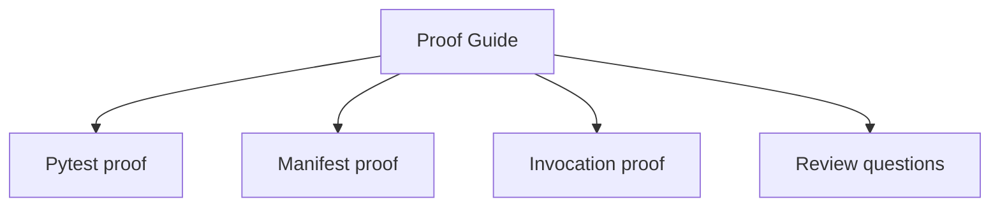
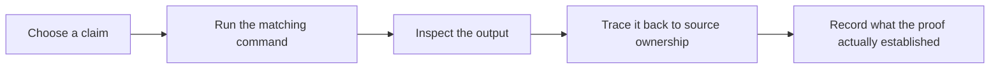

# Proof Guide

<!-- page-maps:start -->
## Guide Maps




<!-- page-maps:end -->

This guide keeps the capstone honest by tying each public claim to one repeatable proof path.

## Base proof

Run:

```bash
make confirm
```

This runs the regression suite proving field validation, registry determinism, manifest
export, and runtime invocation behavior.

## Public-surface proof

Run the public proof surface:

```bash
make proof
```

Or run the CLI pieces individually:

```bash
make manifest
make registry
make demo
make trace
```

These commands prove that the runtime shape and invocation path are inspectable from the
public surface without opening private internals first.

## Review questions

- Which proof demonstrates definition-time behavior?
- Which proof demonstrates preserved callable metadata?
- Which proof demonstrates that the manifest stays observational rather than operational?
