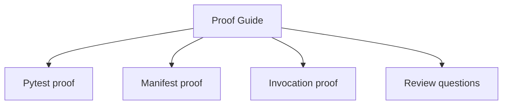
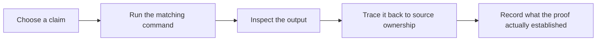

# Proof Guide

<!-- page-maps:start -->
## Guide Maps




<!-- page-maps:end -->

This guide keeps the capstone honest by tying each public claim to one repeatable proof path.

## Base proof

Run:

```bash
make confirm
```

This runs the regression suite proving field validation, registry determinism, manifest
export, and runtime invocation behavior.

## Public-surface proof

After the CLI lands, run:

```bash
python -m incident_plugins.cli manifest --group delivery
python -m incident_plugins.cli invoke delivery console deliver --config prefix='[ops]' --arg title='CPU high' --arg severity='warning' --arg summary='node-1 crossed 90%'
```

These commands prove that the runtime shape and invocation path are inspectable without
opening private internals first.

## Review questions

- Which proof demonstrates definition-time behavior?
- Which proof demonstrates preserved callable metadata?
- Which proof demonstrates that the manifest stays observational rather than operational?
