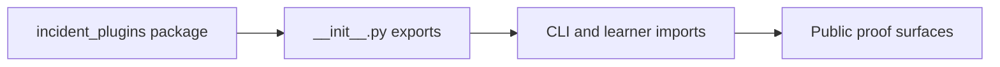
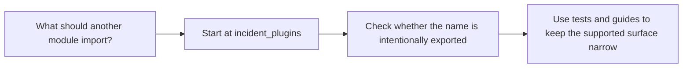

# Public API Guide

<!-- page-maps:start -->
## Guide Maps

<!-- page-maps:end -->

Use this guide when the capstone is no longer only a code-reading exercise and starts to
behave like a small package. The goal is to keep the supported import surface explicit.

## Supported top-level imports

| Need | Start here |
| --- | --- |
| framework review | `PluginBase`, `PluginMeta`, `build_manifest`, `create_plugin`, `invoke` |
| descriptor review | `Field`, `FieldSpec`, `StringField`, `IntegerField`, `BooleanField`, `ChoiceField` |
| decorator review | `action`, `ActionSpec` |
| concrete plugin review | `ConsoleNotifier`, `WebhookNotifier`, `PagerNotifier`, `DeliveryPlugin` |

## What should stay internal by default

- deep imports chosen only because of current file layout
- helper functions that are not exported from `incident_plugins.__init__`
- assumptions about stable internal module boundaries without matching tests or guides

## Best companion guides

- read [PACKAGE_GUIDE.md](PACKAGE_GUIDE.md) when the public surface is clear but internal ownership still matters
- read [TARGET_GUIDE.md](TARGET_GUIDE.md) when the question is really about the public CLI route instead of imports
- read [TEST_GUIDE.md](TEST_GUIDE.md) when you want the proof surface for the exported contract
