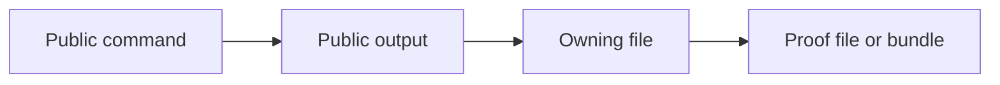
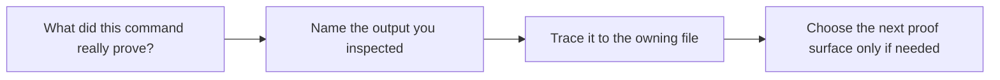

# Public Surface Map

<!-- page-maps:start -->
## Guide Maps

<!-- page-maps:end -->

Use this guide when the public CLI output is already helpful but you still need to know
which runtime boundary owns the information you just inspected. The goal is to keep the
capstone observational surfaces connected to real implementation ownership.

## Command to ownership map

| Command | Main output | First owning file | Best next proof surface |
| --- | --- | --- | --- |
| `make manifest` | group-level field and action metadata | `src/incident_plugins/framework.py` | `tests/test_registry.py` or `PROOF_GUIDE.md` |
| `make plugin` | one concrete plugin contract | `src/incident_plugins/plugins.py` | `tests/test_runtime.py` |
| `make field` | one descriptor-backed field contract | `src/incident_plugins/fields.py` | `tests/test_fields.py` |
| `make action` | one decorator-backed action contract | `src/incident_plugins/actions.py` | `tests/test_runtime.py` |
| `make registry` | registered plugin names and order | `src/incident_plugins/framework.py` | `tests/test_registry.py` |
| `make signatures` | generated constructor and action signatures | `src/incident_plugins/framework.py` and `src/incident_plugins/actions.py` | `tests/test_runtime.py` |
| `make demo` | one concrete invocation result | `src/incident_plugins/plugins.py` and `src/incident_plugins/actions.py` | `TRACE_GUIDE.md` |
| `make trace` | invocation history with config and action metadata | `src/incident_plugins/actions.py` and `src/incident_plugins/plugins.py` | `tests/test_runtime.py` or `tests/test_cli.py` |

## Best reading order by output type

1. Start with `manifest`, `plugin`, `field`, `action`, `registry`, or `signatures` when the question is about public shape.
2. Move to `demo` or `trace` only when the question is about invocation behavior.
3. Move to tests only when the public surface suggests a claim that still needs stronger proof.

## Good ownership checks

Ask these questions after every public route:

- Did this command show a definition-time fact, an attribute-level fact, or a call-time fact?
- Which file owns that fact first?
- Which test would become relevant only if the public output stopped being enough?

## Best companion guides

- `COMMAND_GUIDE.md`
- `TARGET_GUIDE.md`
- `SOURCE_GUIDE.md`
- `PROOF_GUIDE.md`
