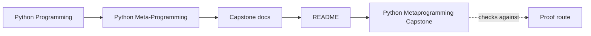
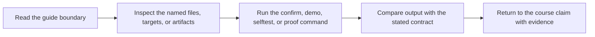

# Python Metaprogramming Capstone


<!-- page-maps:start -->
## Guide Maps




<!-- page-maps:end -->

This capstone is an executable plugin runtime for incident delivery adapters. It is
small enough to audit line by line and large enough to exercise the core tools of
the course in one place:

- descriptor-backed configuration fields
- decorator-based action instrumentation with preserved signatures
- metaclass-driven registration and generated constructors
- introspection-driven manifest export for tooling and debugging

## What it models

- a `PluginMeta` metaclass that registers concrete plugins by group and stable name
- `Field` descriptors that validate and coerce plugin configuration
- an `@action` decorator that records invocations while preserving signatures
- concrete incident-delivery plugins such as console, webhook, and pager adapters
- a runtime manifest that exposes field schemas and action signatures without
  executing plugin methods

## Run it

From this directory:

```bash
make confirm
```

## Read it in this order

- `ARCHITECTURE.md` for ownership boundaries
- `TOUR.md` for a guided file-by-file walk
- `PROOF_GUIDE.md` for the repeatable verification route
- `src/incident_plugins/` for the implementation
- `tests/` for the proof surface

## Why this capstone exists

The course book explains individual mechanisms in isolation. This capstone makes the
integration pressure visible. Class creation, descriptors, wrappers, and inspection
all interact here, so the implementation has to stay honest about:

- which work happens at class-definition time
- what gets validated on assignment versus on invocation
- how signatures survive wrappers
- how registries stay deterministic and resettable in tests

## Layout

- `src/incident_plugins/` contains the framework and built-in plugins.
- `tests/` contains executable verification for descriptors, registration, and runtime manifests.
- `ARCHITECTURE.md`, `TOUR.md`, and `PROOF_GUIDE.md` turn the capstone into a learner-facing proof surface.
