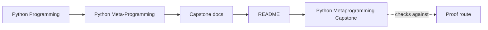
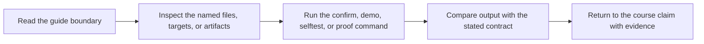

# Python Metaprogramming Capstone


<!-- page-maps:start -->
## Guide Maps




<!-- page-maps:end -->

This capstone is an executable plugin runtime for incident delivery adapters. It is
small enough to audit line by line and large enough to exercise the core tools of
the course in one place:

- descriptor-backed configuration fields
- decorator-based action instrumentation with preserved signatures
- metaclass-driven registration and generated constructors
- introspection-driven manifest export for tooling and debugging

## Start here

Use the smallest honest route for the question you have:

- Want to inspect the public runtime shape without execution? Run `make manifest` or `make registry`.
- Want to inspect one concrete field or action contract? Run `make field` or `make action`.
- Want one full learner-facing review bundle? Run `make PROGRAM=python-programming/python-meta-programming capstone-walkthrough` from the repository root, or `make tour` locally.
- Want executable confirmation? Run `make verify-report`, `make proof`, or `make confirm`.

If you are new to this capstone, the best first route is:

1. Read [INDEX.md](docs/index.md).
2. Run `make manifest`.
3. Read [INDEX.md](docs/index.md).
4. Read [DESIGN_BOUNDARIES.md](docs/design-boundaries.md).
5. Read [ARCHITECTURE.md](docs/architecture.md).
6. Read `src/incident_plugins/framework.py`, then `fields.py`, then `actions.py`.
7. Read the matching tests.

## Start with these defaults

- If you do not know where to begin, read [INDEX.md](docs/index.md).
- If you know the question but not the guide, read [INDEX.md](docs/index.md).
- If you know the guide but not the command, read [COMMAND_GUIDE.md](docs/command-guide.md).
- If you already have a claim and need evidence, read [PROOF_GUIDE.md](docs/proof-guide.md).

## What it models

- a `PluginMeta` metaclass that registers concrete plugins by group and stable name
- `Field` descriptors that validate and coerce plugin configuration
- an `@action` decorator that records invocations while preserving signatures
- concrete incident-delivery plugins such as console, webhook, and pager adapters
- a runtime manifest that exposes field schemas and action signatures without
  executing plugin methods

## Run it

From this directory:

```bash
make confirm
```

Or use the saved review routes:

```bash
make manifest
make registry
make plugin
make field
make action
make signatures
make demo
make trace
make inspect
make tour
make verify-report
make proof
```

From the repository root, use the published course-level routes:

```bash
make PROGRAM=python-programming/python-meta-programming capstone-walkthrough
make PROGRAM=python-programming/python-meta-programming capstone-tour
make PROGRAM=python-programming/python-meta-programming capstone-verify-report
make PROGRAM=python-programming/python-meta-programming capstone-confirm
```

## Documentation set

All supporting capstone guides live under `docs/`. Start from the group that matches
your pressure instead of reading the full list in alphabetical order.

### First-pass orientation

- [INDEX.md](docs/index.md)
- [ARCHITECTURE.md](docs/architecture.md)
- [DESIGN_BOUNDARIES.md](docs/design-boundaries.md)

### Public surface and command choice

- [COMMAND_GUIDE.md](docs/command-guide.md)

### Mechanism and ownership guides

- [ARCHITECTURE.md](docs/architecture.md)
- [DESIGN_BOUNDARIES.md](docs/design-boundaries.md)
- [PACKAGE_GUIDE.md](docs/package-guide.md)
- [EXTENSION_GUIDE.md](docs/extension-guide.md)

### Review, proof, and saved bundles

- [PROOF_GUIDE.md](docs/proof-guide.md)
- [TEST_GUIDE.md](docs/test-guide.md)
- [TOUR.md](docs/tour.md)
- [WALKTHROUGH_GUIDE.md](docs/walkthrough-guide.md)

### Concrete runtime examples

- [PACKAGE_GUIDE.md](docs/package-guide.md)
- [EXTENSION_GUIDE.md](docs/extension-guide.md)

## Read it by question

### "What can I inspect without running business behavior?"

- `make manifest`
- `make registry`
- [COMMAND_GUIDE.md](docs/command-guide.md)

### "Where do wrappers, fields, and class creation live?"

- [ARCHITECTURE.md](docs/architecture.md)
- [DESIGN_BOUNDARIES.md](docs/design-boundaries.md)
- [PACKAGE_GUIDE.md](docs/package-guide.md)
- `src/incident_plugins/actions.py`
- `src/incident_plugins/fields.py`
- `src/incident_plugins/framework.py`

### "What does one concrete plugin look like?"

- `make plugin`
- `make field`
- `make action`
- `make signatures`
- [PACKAGE_GUIDE.md](docs/package-guide.md)
- [DESIGN_BOUNDARIES.md](docs/design-boundaries.md)

### "How do I review the full learner-facing route?"

- [INDEX.md](docs/index.md)
- `make PROGRAM=python-programming/python-meta-programming capstone-walkthrough`
- `make inspect`
- `make tour`
- [WALKTHROUGH_GUIDE.md](docs/walkthrough-guide.md)
- [TOUR.md](docs/tour.md)

### "How do I prove the runtime still works?"

- `make verify-report`
- `make proof`
- `make confirm`
- [TEST_GUIDE.md](docs/test-guide.md)
- [PROOF_GUIDE.md](docs/proof-guide.md)

Use these question routes when you already know the pressure. Otherwise, stay with the
defaults above and escalate only one guide at a time.

## Read it by course stage

- Observation modules: start with `make manifest`, `COMMAND_GUIDE.md`, `make registry`, and `PROOF_GUIDE.md`
- Decorator modules: inspect `src/incident_plugins/actions.py` and the runtime tests
- Descriptor modules: inspect `src/incident_plugins/fields.py`, `DESIGN_BOUNDARIES.md`, and `tests/test_fields.py`
- Metaclass module: inspect `src/incident_plugins/framework.py` and `tests/test_registry.py`
- Governance and mastery: return to `make inspect`, `make verify-report`, and the saved `artifacts/` bundles

## Why this capstone exists

The course book explains individual mechanisms in isolation. This capstone makes the
integration pressure visible. Class creation, descriptors, wrappers, and inspection
all interact here, so the implementation has to stay honest about:

- which work happens at class-definition time
- what gets validated on assignment versus on invocation
- how signatures survive wrappers
- how registries stay deterministic and resettable in tests

## Repository layout

- `src/incident_plugins/` contains the framework and built-in plugins.
- `src/incident_plugins/framework.py` owns registration, generated constructors, and manifest export.
- `src/incident_plugins/fields.py` owns descriptor-backed field contracts.
- `src/incident_plugins/actions.py` owns wrapper-backed action contracts.
- `src/incident_plugins/plugins.py` owns concrete delivery adapters.
- `tests/` contains executable verification for descriptors, registration, and runtime manifests.
- `ARCHITECTURE.md`, `TOUR.md`, `PROOF_GUIDE.md`, and the local guide set turn the capstone into a learner-facing review surface.

## Review routes

- `make manifest` and `make registry` inspect the public runtime shape without invoking plugin behavior.
- `make plugin`, `make field`, `make action`, and `make signatures` isolate one concrete public contract at a time.
- `make demo` and `make trace` inspect one realistic runtime behavior and its recorded history.
- `make inspect` writes the learner-facing inspection bundle with manifest and registry evidence.
- `make tour` writes the learner-facing walkthrough bundle with manifest, registry, demo, and trace outputs.
- `make verify-report` writes the executable verification report bundle with pytest output and public-surface evidence.
- `make confirm` runs the strongest local executable confirmation route.
- `make proof` builds the published learner-facing review route.

Read [DESIGN_BOUNDARIES.md](docs/design-boundaries.md) first when the runtime terms still
feel fuzzier than the commands.

## Best companion guides

- [INDEX.md](docs/index.md) for the smallest honest local route into the doc set
- [COMMAND_GUIDE.md](docs/command-guide.md) for local command selection and artifact locations
- [COMMAND_GUIDE.md](docs/command-guide.md) for connecting commands, outputs, and owning files
- [PROOF_GUIDE.md](docs/proof-guide.md) for change-to-proof alignment and saved review routes
- [ARCHITECTURE.md](docs/architecture.md) for ownership boundaries
- [DESIGN_BOUNDARIES.md](docs/design-boundaries.md) for what each mechanism owns and what it should not own
- [DESIGN_BOUNDARIES.md](docs/design-boundaries.md) for the timing model and ownership rules
- [EXTENSION_GUIDE.md](docs/extension-guide.md) for safe evolution

## Definition of done

- `make inspect` writes the learner-facing inspection bundle with manifest and registry evidence.
- `make tour` writes the guided walkthrough bundle for file-by-file review.
- `make verify-report` captures pytest output together with the public runtime surface.
- `make confirm` completes the strongest local executable confirmation route.
- `make proof` completes the published learner review route end to end.
