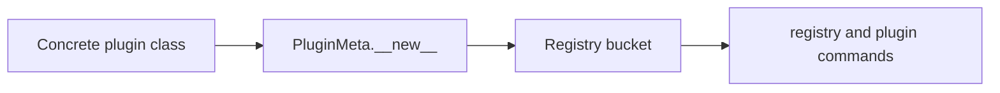

# Registry Guide

<!-- page-maps:start -->
## Guide Maps

<!-- page-maps:end -->

Use this guide when the capstone's registry still feels like hidden metaclass state. The
goal is to make registration deterministic, inspectable, and reviewable as a first-class
runtime surface.

## What the registry owns

| Responsibility | Owning surface |
| --- | --- |
| mapping plugin groups and names to concrete classes | `_REGISTRY` in `framework.py` |
| duplicate-name protection within a group | `_register_plugin()` |
| sorted registry inspection | `PluginMeta.registry()` |
| reset behavior for tests | `PluginMeta.clear_registry()` |

## What the registry should not own

- field coercion and defaults
- action wrapping and history
- manifest detail beyond discovering concrete plugin classes
- CLI parsing policy

## Best proof surfaces

- `tests/test_registry.py` for deterministic order and duplicate rejection
- `make registry` when you want the public observable route
- `make plugin` when you want one concrete class after the registry question is settled

## Best companion guides

- read [DEFINITION_TIME_GUIDE.md](DEFINITION_TIME_GUIDE.md) when the registry question is really about the class-definition sequence
- read [PLUGIN_RUNTIME_GUIDE.md](PLUGIN_RUNTIME_GUIDE.md) when the registry terms still need wider runtime context
- read [MANIFEST_GUIDE.md](MANIFEST_GUIDE.md) once the next question becomes manifest export instead of registration
