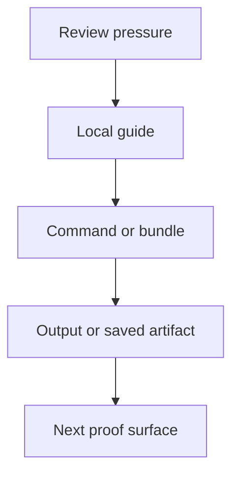
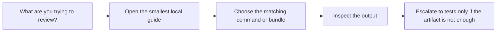

# Review Route Map

<!-- page-maps:start -->
## Guide Maps

<!-- page-maps:end -->

Use this guide when you know the review pressure but still need a durable route through
the local guides, public commands, and saved bundles.

## Pressure to route map

| If you need to review... | Start with | Then run or inspect | Escalate with |
| --- | --- | --- | --- |
| public shape without invocation | `PUBLIC_SURFACE_MAP.md` | `make manifest`, `make registry`, or `make inspect` | `PROOF_GUIDE.md` |
| one concrete field or action contract | `PUBLIC_SURFACE_MAP.md` | `make field`, `make action`, or `make inspect` | `TEST_READING_MAP.md` |
| one realistic invocation story | `FIRST_SESSION_GUIDE.md` or `COMMAND_GUIDE.md` | `make demo`, `make trace`, or `make tour` | `tests/test_runtime.py` |
| source ownership for a change | `SOURCE_TO_PROOF_MAP.md` | the matching public route from the file map | `TEST_GUIDE.md` |
| which proof file should fail first | `TEST_READING_MAP.md` | the matching test file | `SOURCE_GUIDE.md` |
| a saved artifact bundle for another reviewer | `BUNDLE_GUIDE.md` | `make inspect`, `make tour`, or `make verify-report` | `BUNDLE_MANIFEST_GUIDE.md` |
| the strongest local confidence route | `PROOF_GUIDE.md` | `make verify-report`, `make confirm`, or `make proof` | `TEST_GUIDE.md` |

## Good use of this map

- Start from the pressure, not from the broadest target.
- Choose the smallest guide that can still answer the question honestly.
- Use saved bundles when the review needs a durable artifact, not by default.
- Use tests when the guide or artifact suggests a claim that still needs executable proof.

## Best companion guides

- `GUIDE_INDEX.md`
- `COMMAND_GUIDE.md`
- `BUNDLE_GUIDE.md`
- `PROOF_GUIDE.md`
