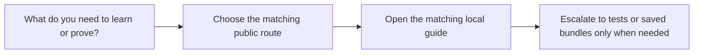

# Scenario Selection Guide

<!-- page-maps:start -->
## Guide Maps

<!-- page-maps:end -->

Use this guide when the capstone now has enough routes that choosing the next one could
become its own source of noise. The goal is to keep route selection proportional to the
metaprogramming question you actually have.

## Route matrix

| If the question is about... | Start with | Then |
| --- | --- | --- |
| what exists publicly before invocation | `make manifest`, `make registry`, `make plugin` | `PLUGIN_RUNTIME_GUIDE.md` and `INSPECTION_GUIDE.md` |
| what generated call shapes look like | `make signatures` | `DEFINITION_TIME_GUIDE.md` and `tests/test_registry.py` |
| what one concrete action does | `make demo` | `SCENARIO_GUIDE.md` and `PLUGIN_CATALOG.md` |
| what the wrapper adds at runtime | `make trace` | `TRACE_GUIDE.md` and `tests/test_runtime.py` |
| what can be reviewed later without rerunning commands | `make inspect`, `make tour`, or `make verify-report` | `BUNDLE_GUIDE.md` and `PROOF_GUIDE.md` |
| what the strongest local bar is | `make confirm` | `TEST_GUIDE.md` |

## Best entry by learner need

- start with the public shape routes if metaclass and descriptor consequences still feel abstract
- start with `signatures` if generated constructors are the main source of confusion
- start with `trace` if decorator behavior still feels magical
- start with saved bundles if the individual commands are clear but the whole review route is not

## Best companion guides

- read [TARGET_GUIDE.md](TARGET_GUIDE.md) when you want the command list restated at the target level
- read [PROOF_GUIDE.md](PROOF_GUIDE.md) when the route question is really a proof-strength question
- read [WALKTHROUGH_GUIDE.md](WALKTHROUGH_GUIDE.md) when you want one staged review order instead of route choice
- read [MECHANISM_SELECTION_GUIDE.md](MECHANISM_SELECTION_GUIDE.md) when the route is clear but the ownership mechanism is not
