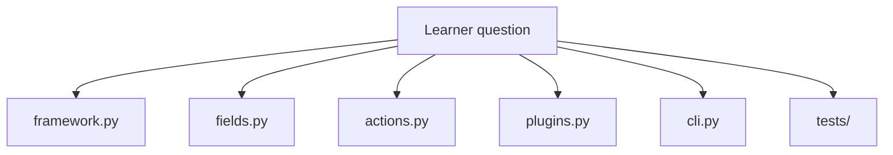
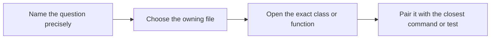

# Source Guide

<!-- page-maps:start -->
## Guide Maps

<!-- page-maps:end -->

Use this guide when the package-level route is still too coarse and you need the exact
file, class, or function that owns a behavior. The goal is to stop learners from reading
the whole capstone just to answer one narrow metaprogramming question.

## Start with the narrowest honest question

| Question | Open this first | Then inspect |
| --- | --- | --- |
| How are plugin classes registered? | `framework.py` | `PluginMeta.__new__`, `_register_plugin()`, `PluginMeta.registry()` |
| How is the plugin constructor generated? | `framework.py` | `_build_signature()`, `_build_init()` |
| How are configuration values validated and stored? | `fields.py` | `Field`, `StringField`, `ChoiceField`, `Field.initialize()` |
| How are action signatures preserved and history recorded? | `actions.py` | `action()`, `ActionSpec.manifest()` |
| What concrete adapters make the framework honest? | `plugins.py` | `ConsoleNotifier`, `WebhookNotifier`, `PagerNotifier` |
| Which public commands expose the runtime? | `cli.py` | `_build_parser()` and the `_handle_*` functions |
| Which executable proof backs this claim? | `tests/` | `test_registry.py`, `test_fields.py`, `test_cli.py`, `test_runtime.py` |

## Best class and function route

1. Start in `framework.py` when the question mentions registration, generated constructors, or manifests.
2. Start in `fields.py` when the question mentions defaults, coercion, required values, or schema metadata.
3. Start in `actions.py` when the question mentions wrappers, preserved signatures, or action history.
4. Start in `plugins.py` when the question mentions one concrete adapter contract.
5. Start in `cli.py` when the question mentions a public inspection or invocation command.
6. Open tests only after you can name the owning implementation surface.

## Best companion guides

- read [PACKAGE_GUIDE.md](PACKAGE_GUIDE.md) when you still need the higher-level file boundary map
- read [TOUR.md](TOUR.md) when you want a broader walkthrough instead of a pinpoint route
- read [TARGET_GUIDE.md](TARGET_GUIDE.md) when the real question is which command to run next
- read [PROOF_GUIDE.md](PROOF_GUIDE.md) when the source location is known and the next step is evidence
