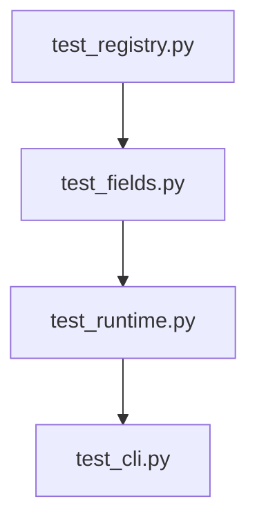
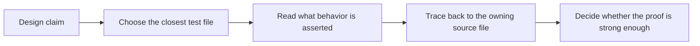

# Test Guide

<!-- page-maps:start -->
## Guide Maps

<!-- page-maps:end -->

Use this guide when you want the shortest path from a metaprogramming claim to the test
that actually proves it. The goal is not to admire coverage. The goal is to know what
kind of pressure each test file is meant to catch.

## Recommended reading order

1. `tests/test_registry.py`
2. `tests/test_fields.py`
3. `tests/test_runtime.py`
4. `tests/test_cli.py`

That route keeps class-definition-time behavior first, descriptor rules second, runtime
invocation third, and public CLI proof last.

## What each file proves

| Test file | Main proof surface | First matching source files |
| --- | --- | --- |
| `test_registry.py` | deterministic registration, duplicate protection, and manifest shape rooted in class creation | `framework.py`, `plugins.py` |
| `test_fields.py` | descriptor validation, coercion, defaults, and per-instance storage behavior | `fields.py`, `plugins.py` |
| `test_runtime.py` | plugin creation, runtime invocation, action history, and manifest observation without execution | `framework.py`, `actions.py`, `plugins.py` |
| `test_cli.py` | public command behavior for manifest, invoke, and trace routes | `cli.py`, `framework.py` |

## Best proof questions

- Which test would fail first if registration started doing hidden work at import time?
- Which test would fail first if descriptor storage leaked between plugin instances?
- Which test would fail first if the action decorator stopped preserving visible behavior?
- Which test would fail first if the CLI became less observational and more magical?

## What this guide prevents

- using one passing CLI test as proof of the entire runtime
- reading only the concrete plugin tests and missing definition-time behavior
- treating metaclass behavior as untestable or too indirect to verify
- forgetting to update the right proof surface when a public command changes
