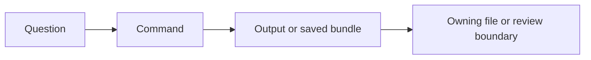
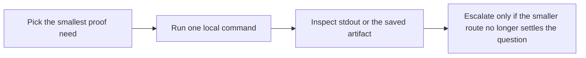

# Command Guide

<!-- page-maps:start -->
## Guide Maps

<!-- page-maps:end -->

Use this guide when you are already inside `capstone/` and need the smallest honest local
command. The goal is not command memorization. The goal is keeping proof proportional to
the question you are trying to answer.

## Start with these commands first

- Start with `make manifest` when you need the safest observational route.
- Start with `make trace` when you already know the question is about one concrete invocation.
- Start with `make inspect` when you need a durable artifact for later reading.

## Do not start with these by default

- Do not start with `make proof` on a first pass; it is broader than most first questions need.
- Do not start with `make confirm` when the question is still about ownership or public shape.
- Do not start with `make demo` when you actually need configuration, history, or preserved metadata.

## Stable local commands

| Command | What it is for | What it gives you |
| --- | --- | --- |
| `make manifest` | inspect exported plugin schema without invocation | public manifest JSON |
| `make plugin` | inspect one concrete plugin contract | one plugin contract JSON |
| `make field` | inspect one descriptor-backed field contract | one field contract JSON |
| `make action` | inspect one decorator-backed action contract | one action contract JSON |
| `make registry` | inspect registration determinism from the public surface | registry JSON |
| `make signatures` | inspect generated constructor and action signatures | signature JSON |
| `make demo` | invoke one realistic action | one invocation result |
| `make trace` | inspect one invocation with configuration and history | trace JSON |
| `make inspect` | build the saved inspection bundle | bundle under `artifacts/inspect/...` |
| `make tour` | build the saved walkthrough bundle | bundle under `artifacts/tour/...` |
| `make verify-report` | build the saved executable verification bundle | bundle under `artifacts/review/...` |
| `make confirm` | run the strongest local executable confirmation route | pytest success or failure |
| `make proof` | build the full learner-facing proof route | all saved bundles together |

## Public runtime surfaces

Use these when the question is not yet about execution, only about what the runtime
publishes honestly from the public surface:

| Surface | What it settles | Best command |
| --- | --- | --- |
| manifest export | which field schema and action metadata the runtime exposes without invocation | `make manifest` or `make plugin` |
| registry export | which concrete plugins exist and in what deterministic order | `make registry` |
| generated signatures | which constructor and action call shapes the runtime exposes | `make signatures` |
| top-level package surface | which names another module should import from `incident_plugins` | `make manifest`, `make registry`, or `make inspect` |

## Supported top-level imports

| Need | Start here |
| --- | --- |
| framework review | `PluginBase`, `PluginMeta`, `build_manifest`, `create_plugin`, `invoke` |
| descriptor review | `Field`, `FieldSpec`, `StringField`, `IntegerField`, `BooleanField`, `ChoiceField` |
| decorator review | `action`, `ActionSpec` |
| concrete plugin review | `ConsoleNotifier`, `WebhookNotifier`, `PagerNotifier`, `DeliveryPlugin` |

## Start by proof size

### Smallest observational routes

Use these when the question is about public runtime shape:

- `make manifest`
- `make plugin`
- `make field`
- `make action`
- `make registry`
- `make signatures`

### One concrete behavior

Use these when the question is about one realistic invocation:

- `make demo`
- `make trace`

### Saved review surfaces

Use these when you need artifacts you can inspect later:

- `make inspect`
- `make tour`
- `make verify-report`

### Strongest confirmation

Use these when you need the broadest local confidence:

- `make confirm`
- `make proof`

## Command to ownership map

| Command | Kind of fact | Main output | First owning file | Best next proof surface |
| --- | --- | --- | --- | --- |
| `make manifest` | inspection-time fact | group-level field and action metadata | `src/incident_plugins/framework.py` | `tests/test_registry.py` or `PROOF_GUIDE.md` |
| `make plugin` | inspection-time fact | one concrete plugin contract | `src/incident_plugins/plugins.py` | `tests/test_runtime.py` |
| `make field` | inspection-time fact | one descriptor-backed field contract | `src/incident_plugins/fields.py` | `tests/test_fields.py` |
| `make action` | inspection-time fact | one decorator-backed action contract | `src/incident_plugins/actions.py` | `tests/test_runtime.py` |
| `make registry` | class-definition fact made observable later | registered plugin names and order | `src/incident_plugins/framework.py` | `tests/test_registry.py` |
| `make signatures` | class-definition fact made observable later | generated constructor and action signatures | `src/incident_plugins/framework.py` and `src/incident_plugins/actions.py` | `tests/test_runtime.py` |
| `make demo` | call-time fact | one concrete invocation result | `src/incident_plugins/plugins.py` and `src/incident_plugins/actions.py` | `TRACE_GUIDE.md` |
| `make trace` | call-time fact with visible metadata | invocation history with config and action metadata | `src/incident_plugins/actions.py` and `src/incident_plugins/plugins.py` | `tests/test_runtime.py` or `tests/test_cli.py` |

## The confusing pairs

- `manifest` versus `registry`
  `manifest` explains schema and action metadata; `registry` explains which plugins are currently registered.
- `manifest` versus `plugin`
  `manifest` shows the whole exported group; `plugin` lets you inspect one concrete plugin contract in isolation.
- `plugin` versus `field`
  `plugin` keeps fields and actions together; `field` isolates one descriptor-backed public contract.
- `field` versus `action`
  `field` isolates descriptor-backed configuration; `action` isolates decorator-backed callable metadata.
- `registry` versus `signatures`
  `registry` proves which plugins exist; `signatures` proves which generated call shapes they expose.
- `demo` versus `trace`
  `demo` shows one result; `trace` shows result, configuration, and recorded action history together.
- `confirm` versus `proof`
  `confirm` is the strongest local confirmation route; `proof` publishes the full learner-facing review route.

## Default choices when unsure

- Choose `manifest` before `registry`.
- Choose `field` or `action` before `plugin` when one contract is the real pressure.
- Choose `trace` before `demo` when metadata or history might matter.
- Choose `inspect` before `tour` when the question is still mainly about ownership.
- Choose `confirm` before `proof` when a human-facing published bundle is not required.

## Default escalation

1. Start with one observational command.
2. Move to one behavior command only if the observational route is not enough.
3. Move to a saved bundle only when you need a durable review surface.
4. Move to `confirm` or `proof` only when the claim truly needs the strongest route.

## Artifact locations

- `make inspect` writes to `../../../../artifacts/inspect/python-programming/python-meta-programming`
- `make tour` writes to `../../../../artifacts/tour/python-programming/python-meta-programming`
- `make verify-report` writes to `../../../../artifacts/review/python-programming/python-meta-programming`

## Best companion guides

- `INDEX.md`
- `ARCHITECTURE.md`
- `PROOF_GUIDE.md`
- `TEST_GUIDE.md`
