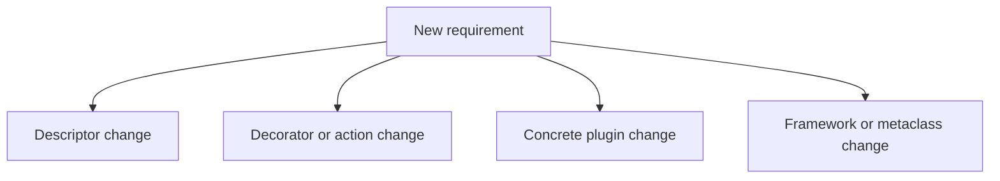
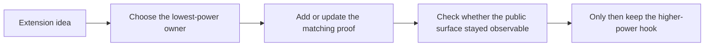

# Extension Guide

<!-- page-maps:start -->
## Guide Maps

<!-- page-maps:end -->

Use this guide when you want to extend the capstone without making the metaprogramming
story clumsy. The rule is simple: use the lowest-power mechanism that keeps the runtime
observable and the ownership boundary explicit.

## Safe extension categories

- Add a concrete plugin in `plugins.py` when the framework contract is already sufficient.
- Add or refine a descriptor in `fields.py` when the change is about configuration validation or schema metadata.
- Add or refine an action wrapper in `actions.py` when the change is about invocation metadata or call discipline.
- Change `framework.py` only when plugin registration, construction, or manifest export genuinely needs a new framework contract.
- Change `cli.py` only when the public inspection or invocation surface needs a new stable command.

## Unsafe extension patterns

- editing the metaclass before proving a concrete plugin or plain helper is insufficient
- making manifest generation execute plugin actions or instantiate plugins unnecessarily
- hiding descriptor storage or action history behind framework-level side effects
- adding a new CLI route without deciding what it proves that existing routes do not

## Best proof route after a change

1. Update the closest test file in `tests/`.
2. Run `make confirm`.
3. Run `make inspect`, `make trace`, or `make verify-report` if the public review surface changed.
4. Update `PROOF_GUIDE.md`, `COMMAND_GUIDE.md`, or `INSPECTION_GUIDE.md` if the best review route changed.

## Review rule

Every extension should answer:

- why this file owns the change
- why a lower-power hook was not enough
- which proof keeps the new behavior visible instead of magical

Read [MECHANISM_SELECTION_GUIDE.md](MECHANISM_SELECTION_GUIDE.md) when the main extension
decision is still which metaprogramming mechanism deserves the change.
